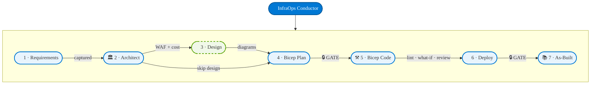

<!-- markdownlint-disable MD013 MD033 MD041 -->

<a id="readme-top"></a>

<div align="center">
  
</div>

<!-- PROJECT SHIELDS -->
<div align="center">

[![Contributors][contributors-shield]][contributors-url]
[![Forks][forks-shield]][forks-url]
[![Stargazers][stars-shield]][stars-url]
[![Issues][issues-shield]][issues-url]
[![MIT License][license-shield]][license-url]
[![Azure][azure-shield]][azure-url]

<!-- TECH STACK BADGES -->

[][azure-url]
[][azure-url]
[][azure-url]
[][azure-url]
[][azure-url]
[][azure-url]
[][azure-url]

</div>

<br />
<div align="center">
  <a href="https://github.com/jonathan-vella/azure-agentic-infraops-workshop">
    
  </a>

  <h1 align="center">Agentic InfraOps Microhack</h1>

  <p align="center">
    <strong>From requirements to deployed Azure infrastructure — powered by AI agents</strong>
    <br />
    <em>A 6-hour hands-on workshop for technical audiences</em>
    <br />
    <br />
    <a href="#️⃣-quick-start"><strong>Quick Start »</strong></a>
    ·
    <a href="docs/getting-started.md">Requirements Guide</a>
    ·
    <a href="microhack/README.md">Microhack Guide</a>
    ·
    <a href="agent-output/">Sample Outputs</a>
    ·
    <a href="https://github.com/jonathan-vella/azure-agentic-infraops-workshop/issues/new?labels=bug">Report Bug</a>
  </p>
</div>

---

## What is Agentic InfraOps?

A **structured 7-step workflow** that coordinates specialized AI agents through a complete Azure infrastructure development cycle — enforcing WAF alignment and AVM best practices at every phase.

> Built upon [copilot-orchestra](https://github.com/ShepAlderson/copilot-orchestra) and [Copilot-Atlas](https://github.com/bigguy345/Github-Copilot-Atlas), adapted for Azure infrastructure workflows.

|                         |                                                       |
| ----------------------- | ----------------------------------------------------- |
| 🎭 **Multi-Agent**      | InfraOps Conductor orchestrates 7 specialized agents  |
| 🏛️ **WAF-Aligned**      | All decisions evaluated against the 5 WAF pillars     |
| 🔍 **Preflight Checks** | Lint · What-If · Review subagents before every deploy |
| ⏸️ **Approval Gates**   | Human-in-the-loop at every critical decision point    |
| 📋 **Audit Trail**      | Numbered artifacts (01–07) per project                |
| 💎 **Context-Safe**     | Each agent runs in its own isolated context window    |

---

## 🗺️ The 7-Step Pipeline



---

## 🎓 Microhack — 6-Hour Hands-On Challenge

> **For:** IT Pros new to IaC · Teams of 3–4 · Coaches & trainers · 20–24 participants

Transform a business brief into deployed, documented Azure infrastructure — using AI agents.

### 🏁 8 Progressive Challenges

| #   | Challenge               | Focus                       | Difficulty |
| --- | ----------------------- | --------------------------- | ---------- |
| 1   | Requirements Capture    | AI-assisted discovery       | ⭐         |
| 2   | Architecture Assessment | WAF + cost estimation       | ⭐⭐       |
| 3   | Implementation Planning | Governance & Bicep plan     | ⭐⭐       |
| 4   | 🌀 DR Curveball         | Surprise requirement change | ⭐⭐⭐     |
| 5   | Bicep Code Generation   | AVM-first templates         | ⭐⭐⭐     |
| 6   | Load Testing            | Performance validation      | ⭐⭐⭐     |
| 7   | As-Built Documentation  | Full audit trail            | ⭐⭐       |
| 8   | Partner Showcase        | Present & defend decisions  | ⭐⭐       |

📖 **[Start the Microhack →](microhack/README.md)**

---

<details>
<summary>🤖 Agent Roster</summary>

## 🤖 Agent Roster

| Step | Agent                  | Persona       | Role                              | Model             |
| ---- | ---------------------- | ------------- | --------------------------------- | ----------------- |
| —    | **InfraOps Conductor** | 🎼 Maestro    | Master orchestrator               | Claude Opus 4.6   |
| 1    | `requirements`         | 📜 Scribe     | Requirements capture              | Claude Opus 4.6   |
| 2    | `architect`            | 🏛️ Oracle     | WAF assessment + cost             | Claude Opus 4.6   |
| 3    | `design`               | 🎨 Artisan    | Diagrams + ADRs _(optional)_      | Claude Sonnet 4.5 |
| 4    | `bicep-plan`           | 📐 Strategist | Implementation planning           | Claude Opus 4.6   |
| 5    | `bicep-code`           | ⚒️ Forge      | AVM-first Bicep templates         | Claude Sonnet 4.5 |
| 6    | `deploy`               | 🚀 Envoy      | Azure provisioning                | Claude Sonnet 4.5 |
| 7    | —                      | 📚 —          | As-built docs (via skills)        | —                 |
| —    | `diagnose`             | 🔍 Sentinel   | Resource health & troubleshooting | —                 |

**Validation subagents** (auto-invoked pre-deploy): `bicep-lint` · `bicep-whatif` · `bicep-review`

<p align="right">(<a href="#readme-top">back to top</a>)</p>

</details>

---

<details>
<summary>📋 Step-by-Step Output Reference</summary>

## 📋 Step-by-Step Output Reference

| Step | Agent        | Output file(s)                                                                                             | Gate           |
| ---- | ------------ | ---------------------------------------------------------------------------------------------------------- | -------------- |
| 1    | requirements | `01-requirements.md`                                                                                       | —              |
| 2    | architect    | `02-architecture-assessment.md`                                                                            | —              |
| 3    | design       | `03-des-*.md/.py/.png`                                                                                     | —              |
| 4    | bicep-plan   | `04-implementation-plan.md` · `04-governance-constraints.md`                                               | 🔒 Approval    |
| 5    | bicep-code   | `infra/bicep/{project}/` · `05-implementation-reference.md`                                                | 🔒 Pre-deploy  |
| 6    | deploy       | `06-deployment-summary.md`                                                                                 | 🔒 Post-deploy |
| 7    | —            | `07-design-document.md` · `07-operations-runbook.md` · `07-backup-dr-plan.md` · `07-resource-inventory.md` | —              |

All outputs land in `agent-output/{project}/`. See [`agent-output/_sample/`](agent-output/_sample/) for examples.

<p align="right">(<a href="#readme-top">back to top</a>)</p>

</details>

---

<details>
<summary>⚡ Quick Start</summary>

## ⚡ Quick Start

### 1️⃣ Clone & open in Dev Container

```bash
git clone https://github.com/jonathan-vella/azure-agentic-infraops-workshop.git
cd azure-agentic-infraops-workshop && code .
```

Press `F1` → **Dev Containers: Reopen in Container** _(first build ~2–3 min)_

### 2️⃣ Enable agent subagents

In VS Code **User Settings** (`Ctrl+,`):

```json
{ "chat.customAgentInSubagent.enabled": true }
```

### 3️⃣ Launch the Conductor

`Ctrl+Shift+I` → select **InfraOps Conductor** → describe your workload:

```text
Create a web app with Azure App Service, Key Vault, and SQL Database
```

<p align="right">(<a href="#readme-top">back to top</a>)</p>

</details>

---

<details>
<summary>💡 Usage Examples</summary>

## 💡 Usage Examples

**Full workflow** — open Chat (`Ctrl+Shift+I`), select **InfraOps Conductor**, then:

```text
Create an e-commerce platform with AKS, Cosmos DB, and Redis caching
```

The Conductor walks through all 7 steps, pausing at each 🔒 gate for your approval.

**Direct agent invocation** for focused tasks:

```text
@requirements  Capture requirements for a static web app
@architect     Assess the requirements in 01-requirements.md
@diagnose      Check health of my App Service apps
```

<p align="right">(<a href="#readme-top">back to top</a>)</p>

</details>

---

<details>
<summary>🧰 Skills &amp; Artifacts</summary>

## 🧰 Skills &amp; Artifacts

**8 reusable skills** auto-invoked by agents:
`azure-adr` · `azure-artifacts` · `azure-defaults` · `azure-diagrams` · `docs-writer` · `git-commit` · `github-operations` · `make-skill-template`

**Generated artifacts** land in `agent-output/{project}/` — see [`_sample/`](agent-output/_sample/) for the full template set.

<p align="right">(<a href="#readme-top">back to top</a>)</p>

</details>

---

<details>
<summary>🧩 MCP Integration</summary>

## 🧩 MCP Integration

| MCP Server      | Purpose                                                         |
| --------------- | --------------------------------------------------------------- |
| **Azure MCP**   | 40+ Azure service areas — RBAC-aware, Day-0 to Day-2 operations |
| **Pricing MCP** | Real-time Azure retail pricing for cost-aware SKU decisions     |

📖 [Azure MCP Server](https://github.com/microsoft/mcp/blob/main/servers/Azure.Mcp.Server/README.md) · [Pricing MCP Docs](mcp/azure-pricing-mcp/)

<p align="right">(<a href="#readme-top">back to top</a>)</p>

</details>

---

<details>
<summary>📁 Project Structure</summary>

## 📁 Project Structure

```text
├── .github/agents/        # 8 agents + 3 validation subagents
├── .github/skills/        # 8 reusable skills
├── .github/instructions/  # Guardrails and coding standards
├── agent-output/          # Generated artifacts per project
├── docs/                  # Documentation and guides
├── microhack/             # 🎓 6-hour hands-on microhack
├── infra/bicep/           # Generated Bicep templates
├── mcp/azure-pricing-mcp/ # 💰 Pricing MCP add-on
└── scripts/               # Validation, scoring, and cleanup
```

<p align="right">(<a href="#readme-top">back to top</a>)</p>

</details>

---

<details>
<summary>⚙️ Configuration</summary>

## ⚙️ Configuration

**Required** VS Code setting (User Settings or `devcontainer.json`):

```json
{ "chat.customAgentInSubagent.enabled": true }
```

**Recommended:**

```json
{
  "github.copilot.chat.responsesApiReasoningEffort": "high",
  "chat.thinking.style": "detailed"
}
```

Agents are defined in `.github/agents/*.agent.md` — edit `model`, instructions, or `tools` to customise.

<p align="right">(<a href="#readme-top">back to top</a>)</p>

</details>

---

<details>
<summary>📋 Requirements</summary>

## 📋 Requirements

| Requirement            | Details                                                                                   |
| ---------------------- | ----------------------------------------------------------------------------------------- |
| **VS Code**            | With [GitHub Copilot](https://marketplace.visualstudio.com/items?itemName=GitHub.copilot) |
| **Dev Container**      | [Docker Desktop](https://www.docker.com/products/docker-desktop/) or Codespaces           |
| **Azure subscription** | For deployments (optional for learning)                                                   |

Dev Container includes: Azure CLI + Bicep · PowerShell 7+ · Python 3.10+ · all VS Code extensions · Pricing MCP · diagrams library

📋 **Full prerequisites, quota requirements, and setup checklist**: [docs/getting-started.md](docs/getting-started.md)

<p align="right">(<a href="#readme-top">back to top</a>)</p>

</details>

---

<details>
<summary>🤝 Contributing &amp; License</summary>

## 🤝 Contributing &amp; License

Contributions welcome — see [CONTRIBUTING.md](CONTRIBUTING.md) and [docs/guides/contributing.md](docs/guides/contributing.md). We use [Conventional Commits](https://www.conventionalcommits.org/).

MIT License — see [LICENSE](LICENSE).

<p align="right">(<a href="#readme-top">back to top</a>)</p>

</details>

---

<details>
<summary>Acknowledgments</summary>

## Acknowledgments

- [azure-agentic-infraops](https://github.com/jonathan-vella/azure-agentic-infraops) — the upstream project this workshop is based on
- [copilot-orchestra](https://github.com/ShepAlderson/copilot-orchestra) — multi-agent orchestration patterns
- [Github-Copilot-Atlas](https://github.com/bigguy345/Github-Copilot-Atlas) — context conservation and parallel execution inspiration

<p align="right">(<a href="#readme-top">back to top</a>)</p>

</details>

---

<div align="center">
  <p>
    Made with ❤️ by <a href="https://github.com/jonathan-vella">Jonathan Vella</a>
  </p>
  <p>
    <a href="https://github.com/jonathan-vella/azure-agentic-infraops-workshop">
      
    </a>
  </p>
</div>

<!-- MARKDOWN LINKS & IMAGES -->

[contributors-shield]: https://img.shields.io/github/contributors/jonathan-vella/azure-agentic-infraops-workshop.svg?style=for-the-badge
[contributors-url]: https://github.com/jonathan-vella/azure-agentic-infraops-workshop/graphs/contributors
[forks-shield]: https://img.shields.io/github/forks/jonathan-vella/azure-agentic-infraops-workshop.svg?style=for-the-badge
[forks-url]: https://github.com/jonathan-vella/azure-agentic-infraops-workshop/network/members
[stars-shield]: https://img.shields.io/github/stars/jonathan-vella/azure-agentic-infraops-workshop.svg?style=for-the-badge
[stars-url]: https://github.com/jonathan-vella/azure-agentic-infraops-workshop/stargazers
[issues-shield]: https://img.shields.io/github/issues/jonathan-vella/azure-agentic-infraops-workshop.svg?style=for-the-badge
[issues-url]: https://github.com/jonathan-vella/azure-agentic-infraops-workshop/issues
[license-shield]: https://img.shields.io/github/license/jonathan-vella/azure-agentic-infraops-workshop.svg?style=for-the-badge
[license-url]: https://github.com/jonathan-vella/azure-agentic-infraops-workshop/blob/main/LICENSE
[azure-shield]: https://img.shields.io/badge/Azure-Ready-0078D4?style=for-the-badge&logo=microsoftazure&logoColor=white
[azure-url]: https://azure.microsoft.com
