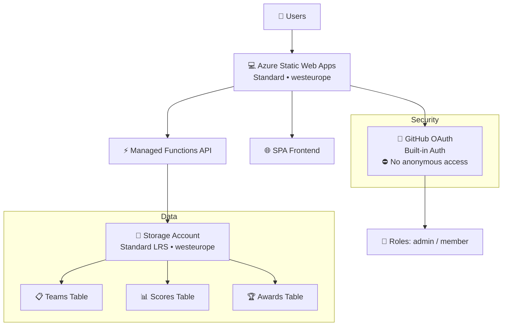
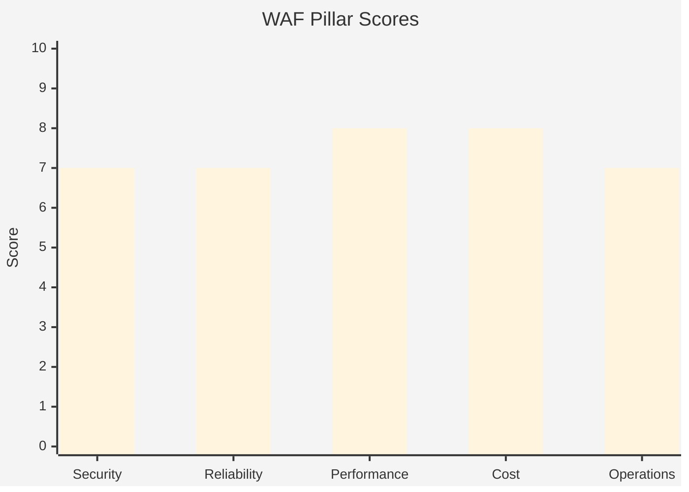

# Step 2: Architecture Assessment - hacker-board

<strong>📑 Table of Contents</strong>

- [Requirements Validation ✅](#requirements-validation-)
- [Executive Summary](#executive-summary)
- [WAF Pillar Assessment](#waf-pillar-assessment)
- [Resource SKU Recommendations](#resource-sku-recommendations)
- [Architecture Decision Summary](#architecture-decision-summary)
- [Implementation Handoff](#implementation-handoff)
- [Approval Gate](#approval-gate)
- [References](#references)

> Generated by architect agent | 2026-02-11

| ⬅️ Previous                              | 📑 Index            | Next ➡️                                            |
| ---------------------------------------- | ------------------- | -------------------------------------------------- |
| [01-requirements.md](01-requirements.md) | [README](README.md) | [03-des-cost-estimate.md](03-des-cost-estimate.md) |

## Requirements Validation ✅

| Category                    | Status      | Notes                                                         |
| --------------------------- | ----------- | ------------------------------------------------------------- |
| **Functional Requirements** | ✅ Complete | 8 features (F1–F8), roles (admin/member), data model defined |
| **NFRs**                    | ✅ Complete | SLA 99.9%, RTO 4h, RPO 1h, <2s response, 50 users             |
| **Compliance**              | ✅ Complete | GDPR minimal PII, 6 security controls                         |
| **Budget**                  | ✅ Complete | $50+/mo budget, ~$10/mo estimated                             |
| **Regional Preferences**    | ✅ Complete | westeurope (all resources, single region)                     |
| **Deployment**              | ✅ Complete | Bicep IaC + "Deploy to Azure" button + deploy.ps1             |
| **Owner Tag**               | ✅ Complete | `agentic-infraops`                                            |

> [!WARNING]
> No ❌ items detected. All requirement categories are documented with actionable values.

### Validation Summary

All required categories are documented with actionable values. No blocking gaps. The workload is well-scoped: a small-scale event scoring tool with authentication, simple CRUD operations, and a read-heavy leaderboard. Architecture assessment can proceed.

## Executive Summary

### Recommended Architecture

**Azure Static Web Apps (Standard) + Azure Table Storage** — a serverless, low-cost architecture for hosting a microhack scoring dashboard with GitHub authentication.

| Attribute                  | Value                                                           |
| -------------------------- | --------------------------------------------------------------- |
| **Pattern**                | Static Site with serverless API                                 |
| **Primary Region**         | `westeurope` (all resources — single region)                    |
| **Estimated Monthly Cost** | ~$9.05                                                          |
| **Composite WAF Score**    | **7.4/10**                                                      |
| **Primary Optimization**   | 💰 Cost — minimise spend for an event-driven, non-critical tool |
| **Secondary Optimization** | 🔧 Operations — simple deploy via "Deploy to Azure" and Bicep   |

### Recommended Architecture

### Why This Architecture

1. **Cheapest viable option** — SWA Standard at $9/mo includes managed Functions, custom auth, free SSL, and global CDN. No separate App Service Plan, Function App, or API Management needed.
2. **Zero-server operations** — fully managed PaaS; no VMs, no patching, no scaling configuration.
3. **GitHub auth built-in** — SWA natively supports GitHub OAuth with role assignments via `staticwebapp.config.json`. All users must authenticate — no anonymous access. Two roles: `admin` (full CRUD) and `member` (view-only + own profile).
4. **Table Storage for simplicity** — scoring and attendee data is simple key-value with known partition keys (team names, GitHub usernames). No relational joins needed. At <1 GB and <10K transactions/month, cost is effectively $0.

## WAF Pillar Assessment

### 🔒 Security — 7/10 (Confidence: High)

| Area                   | Assessment                                                                                                                                                                                         | Score |
| ---------------------- | -------------------------------------------------------------------------------------------------------------------------------------------------------------------------------------------------- | ----- |
| **Identity**           | GitHub OAuth via SWA built-in auth — **mandatory for all users, no anonymous access**. Role-based access (`admin` vs `member`) via `staticwebapp.config.json`. All routes require authentication. | 9/10  |
| **Network**            | HTTPS-only by default (SWA enforced). TLS 1.2 minimum. No public API endpoints outside SWA — Functions are only accessible via the SWA reverse proxy.                                              | 7/10  |
| **Data Protection**    | Azure Table Storage encryption at rest (SSE, AES-256, Microsoft-managed keys). No sensitive PII stored — only GitHub usernames and team names.                                                     | 7/10  |
| **Threat Detection**   | No WAF, DDoS Standard, or Defender enabled. Acceptable for a low-risk, event-scoped tool. SWA has basic DDoS protection via Azure infrastructure.                                                  | 5/10  |
| **Secrets Management** | Connection strings stored in SWA application settings (encrypted at rest). No Key Vault for this tier — acceptable given the workload risk profile.                                                | 7/10  |

**Gaps & Recommendations:**

| Gap                           | Impact                                        | Recommendation                                                                       | Priority |
| ----------------------------- | --------------------------------------------- | ------------------------------------------------------------------------------------ | -------- |
| No Key Vault                  | Secrets in SWA app settings (not rotatable)   | Accept for event tool; add KV for production use                                     | Low      |
| No WAF/DDoS Standard          | Vulnerable to sophisticated DDoS              | Accept risk — SWA has basic Azure-level DDoS protection                              | Low      |
| No Defender for Cloud         | No threat alerts                              | Accept — minimal attack surface, event-scoped                                        | Low      |
| Storage account public access | Table Storage reachable if conn string leaked | Use managed identity for SWA→Storage binding when supported; restrict network access | Medium   |

### 🔄 Reliability — 7/10 (Confidence: High)

| Area                  | Assessment                                                                                                                                                                      | Score |
| --------------------- | ------------------------------------------------------------------------------------------------------------------------------------------------------------------------------- | ----- |
| **SLA**               | SWA Standard SLA: 99.95%. Exceeds 99.9% target.                                                                                                                                 | 8/10  |
| **Redundancy**        | SWA: global CDN with edge distribution. Storage: LRS (3 copies in single datacenter). No cross-region replication.                                                              | 6/10  |
| **Disaster Recovery** | RTO 4h / RPO 1h target. SWA redeployable from Git in <30 min. Storage LRS does not protect against datacenter loss. Manual backup of Table Storage required for RPO compliance. | 6/10  |
| **Health Monitoring** | SWA built-in metrics (requests, errors, latency). No custom health probes or alerting configured.                                                                               | 7/10  |
| **Fault Tolerance**   | Managed Functions auto-restart on failure. Table Storage retries built into Azure SDK. No circuit breaker pattern needed for this scale.                                        | 8/10  |

**Gaps & Recommendations:**

| Gap                      | Impact                                        | Recommendation                                                                   | Priority |
| ------------------------ | --------------------------------------------- | -------------------------------------------------------------------------------- | -------- |
| Storage LRS only         | Data loss on datacenter failure               | Accept for event data; upgrade to GRS for critical use                           | Low      |
| No automated backup plan | RPO 1h target at risk without explicit backup | Implement a scheduled Azure Function to export Table data to Blob snapshot daily | Medium   |
| No alerting rules        | Issues detected only when users report        | Add 1-2 Azure Monitor alerts (5xx rate, latency) — free tier covers this         | Low      |

### ⚡ Performance — 8/10 (Confidence: High)

| Area              | Assessment                                                                                                                                              | Score |
| ----------------- | ------------------------------------------------------------------------------------------------------------------------------------------------------- | ----- |
| **Response Time** | SWA CDN serves static assets from edge. <200ms for HTML/JS/CSS. API calls to Functions + Table Storage: <500ms for simple CRUD. Well within <2s target. | 9/10  |
| **Scalability**   | SWA + Functions Consumption auto-scales transparently. Table Storage handles millions of entities. 50 concurrent users is trivial.                      | 9/10  |
| **Caching**       | SWA CDN caches static assets at edge. No server-side caching for API responses (not needed at this scale).                                              | 7/10  |
| **Load Testing**  | Not planned. Acceptable — workload is far below any scaling threshold.                                                                                  | 6/10  |

**Gaps & Recommendations:**

| Gap                     | Impact                                        | Recommendation                                                 | Priority |
| ----------------------- | --------------------------------------------- | -------------------------------------------------------------- | -------- |
| No API response caching | Leaderboard re-queries Table on every request | Add `Cache-Control` headers for leaderboard endpoint (30s TTL) | Low      |
| No CDN purge strategy   | Stale frontend after deploy                   | SWA auto-invalidates on deploy — no action needed              | N/A      |

### 💰 Cost — 8/10 (Confidence: High)

| Area                      | Assessment                                                                                                                              | Score |
| ------------------------- | --------------------------------------------------------------------------------------------------------------------------------------- | ----- |
| **Right-Sizing**          | SWA Standard is the minimum SKU supporting custom auth and SLA. Table Storage LRS is cheapest persistence option. No over-provisioning. | 9/10  |
| **Cost Predictability**   | Fixed $9/mo for SWA. Table Storage <$0.10/mo. Total highly predictable at ~$9.05/mo. Well within $50/mo budget.                         | 9/10  |
| **Cost Monitoring**       | Azure Cost Management available. Budget alerts can be set on the resource group.                                                        | 7/10  |
| **Optimization Leverage** | SWA Free tier possible if custom auth not required (saves $9/mo). Event-scoped — can delete resources after microhack to stop billing.  | 8/10  |

**Gaps & Recommendations:**

| Gap                            | Impact                                  | Recommendation                                                       | Priority |
| ------------------------------ | --------------------------------------- | -------------------------------------------------------------------- | -------- |
| No cost alert                  | Could miss unexpected bandwidth charges | Set $15/mo budget alert on resource group                            | Low      |
| No resource cleanup automation | Forgotten resources continue billing    | Document cleanup procedure; optionally set resource group expiry tag | Low      |

### 🔧 Operations — 7/10 (Confidence: High)

| Area                       | Assessment                                                                                                              | Score |
| -------------------------- | ----------------------------------------------------------------------------------------------------------------------- | ----- |
| **Infrastructure as Code** | Bicep templates with AVM modules. "Deploy to Azure" button for one-click provisioning. `deploy.ps1` for CLI deployment. | 9/10  |
| **CI/CD**                  | SWA + GitHub Actions built-in integration. Auto-deploys on push to main. Preview environments for PRs.                  | 8/10  |
| **Monitoring**             | SWA built-in metrics. Application Insights optional (free tier). No custom dashboards planned.                          | 6/10  |
| **Incident Response**      | No runbook. No on-call rotation. Acceptable for event-scoped tool.                                                      | 5/10  |
| **Documentation**          | Scoring rubric is well-documented. Architecture docs generated via this workflow. Deploy button provides self-service.  | 8/10  |

**Gaps & Recommendations:**

| Gap                     | Impact                              | Recommendation                                                                | Priority |
| ----------------------- | ----------------------------------- | ----------------------------------------------------------------------------- | -------- |
| No Application Insights | Limited visibility into API errors  | Enable App Insights (free 5 GB/mo) with SWA integration                       | Medium   |
| No incident runbook     | Ad-hoc troubleshooting during event | Create simple troubleshooting doc (SWA logs, Function logs, Table queries)    | Low      |
| No staging slot testing | Direct-to-prod deployments          | SWA Standard supports preview environments per PR — enable in GitHub workflow | Medium   |

### Service Maturity Assessment

| Service                   | GA Status | Maturity    | Deprecation Risk | Notes                                                   |
| ------------------------- | --------- | ----------- | ---------------- | ------------------------------------------------------- |
| Azure Static Web Apps     | GA (2021) | Mature      | 🟢 Low           | Active development, recent Database Connections preview |
| Azure Functions (Managed) | GA        | Mature      | 🟢 Low           | Core Azure service, consumption model stable            |
| Azure Table Storage       | GA (2012) | Very Mature | 🟢 Low           | Foundational storage service, no deprecation signals    |
| GitHub OAuth (SWA)        | GA        | Mature      | 🟢 Low           | Built-in provider, Microsoft-maintained                 |

### Composite WAF Score

| Pillar         | Score      | Weight | Weighted Score | Confidence |
| -------------- | ---------- | ------ | -------------- | ---------- |
| 🔒 Security    | 7/10       | 20%    | 1.40           | High       |
| 🔄 Reliability | 7/10       | 20%    | 1.40           | High       |
| ⚡ Performance | 8/10       | 20%    | 1.60           | High       |
| 💰 Cost        | 8/10       | 20%    | 1.60           | High       |
| 🔧 Operations  | 7/10       | 20%    | 1.40           | High       |
| **Composite**  | **7.4/10** |        | **7.40**       | **High**   |

> A score of 7.4/10 indicates an architecture that **meets best practices with minor gaps**, appropriate for a non-critical, event-scoped workload. Gaps are intentional trade-offs for cost optimization.

## Resource SKU Recommendations

| Resource              | SKU                       | Region       | Monthly Cost | Rationale                                           |
| --------------------- | ------------------------- | ------------ | ------------ | --------------------------------------------------- |
| Azure Static Web Apps | **Standard**              | `westeurope` | $9.00        | Minimum SKU for custom auth, SLA, managed Functions |
| Azure Storage Account | **Standard LRS**          | `westeurope` | ~$0.05       | Co-located with SWA to minimise latency             |
| Azure Table Storage   | _(included in Storage)_   | `westeurope` | ~$0.00       | <1 GB data, <10K transactions — effectively free    |
| Azure Functions       | **Consumption (Managed)** | `westeurope` | $0.00        | Included in SWA Standard; <1M executions            |
| Application Insights  | **Free tier (5 GB/mo)**   | `westeurope` | $0.00        | Optional but recommended for API observability      |
| **Total**             |                           |              | **~$9.05**   |                                                     |

### SKU Alternatives Considered

<strong>Azure Static Web Apps</strong> — Tier Comparison

| Tier            | Features                            | Price/mo | Fits?                     |
| --------------- | ----------------------------------- | -------- | ------------------------- |
| Free            | Basic auth, 250 MB storage          | $0       | ❌ No custom auth, no SLA |
| Standard        | Custom auth, SLA, managed Functions | $9       | ✅ Selected               |
| Enterprise Edge | Front Door CDN, advanced DDoS       | $26+     | ⚠️ Overkill for 50 users  |

**Selected**: Standard — minimum SKU for custom GitHub auth + SLA

<strong>Azure Storage</strong> — Redundancy Comparison

| Redundancy | Copies           | Price/GB/mo | Fits?                         |
| ---------- | ---------------- | ----------- | ----------------------------- |
| LRS        | 3 (single DC)    | $0.045      | ✅ Selected                   |
| ZRS        | 3 (across AZs)   | $0.056      | ⚠️ More resilient, not needed |
| GRS        | 6 (cross-region) | $0.090      | ❌ Overkill for event data    |

**Selected**: LRS — event data is non-critical, local redundancy sufficient

## Architecture Decision Summary

| #     | Decision               | Choice                                                | Alternatives Considered                                 | Rationale                                                                                  |
| ----- | ---------------------- | ----------------------------------------------------- | ------------------------------------------------------- | ------------------------------------------------------------------------------------------ |
| ADR-1 | **Hosting platform**   | Azure Static Web Apps (Standard)                      | App Service, Container Apps, Azure Functions standalone | Cheapest option with built-in auth, managed Functions, global CDN, free SSL                |
| ADR-2 | **Data persistence**   | Azure Table Storage (Standard LRS)                    | Cosmos DB, Azure SQL, Blob Storage                      | Simplest and cheapest for key-value scoring + attendee data; no relational features needed |
| ADR-3 | **Authentication**     | GitHub OAuth (SWA built-in) — mandatory, no anonymous | Azure AD B2C, Auth0, custom JWT                         | Zero-config, free, all users must authenticate via GitHub                                  |
| ADR-4 | **API layer**          | Managed Functions (within SWA)                        | Standalone Function App, Express.js on App Service      | No separate billing, no separate deployment, integrated auth context                       |
| ADR-5 | **Deployment method**  | Bicep + "Deploy to Azure" button + deploy.ps1         | ARM templates, Terraform, Pulumi                        | Bicep is native Azure IaC; Deploy button enables self-service                              |
| ADR-6 | **Storage redundancy** | LRS (local)                                           | GRS, ZRS, RA-GRS                                        | Event data is non-critical; LRS provides 3 copies in single DC                             |
| ADR-7 | **Region strategy**    | Single region: `westeurope` (all resources)           | Split region (SWA westeurope + Storage swedencentral)   | Co-location eliminates cross-region latency; westeurope is GDPR-compliant (EU)             |

### Trade-offs Explicitly Accepted

| Trade-off            | What We Give Up                | What We Gain                   | Reversal Cost                 |
| -------------------- | ------------------------------ | ------------------------------ | ----------------------------- |
| No Key Vault         | Rotatable secrets, audit trail | Simpler architecture, $0 saved | ~$0.03/mo to add              |
| No WAF/DDoS Standard | Advanced DDoS protection       | $36+/mo saved                  | Add Enterprise Edge tier      |
| LRS not GRS          | Cross-region data protection   | ~$0.04/mo saved                | Change SKU parameter in Bicep |
| No multi-region      | <1 min failover                | Simplified deployment          | Significant re-architecture   |
| No private endpoints | Network isolation              | $0 saved, simpler networking   | Add PE resources to Bicep     |

## Implementation Handoff

### Resources for Bicep Plan Agent

| Resource                      | Type                    | Module                                             | Priority      |
| ----------------------------- | ----------------------- | -------------------------------------------------- | ------------- |
| `rg-hacker-board-prod`        | Resource Group          | N/A (deployment scope)                             | P0            |
| `stapp-hacker-board-prod`     | Static Web App          | `br/public:avm/res/web/static-site`                | P0            |
| `stteamlbrdprod{suffix}`      | Storage Account         | `br/public:avm/res/storage/storage-account`        | P0            |
| `appi-hacker-board-prod`      | Application Insights    | `br/public:avm/res/insights/component`             | P1 (optional) |
| `log-hacker-board-prod`       | Log Analytics Workspace | `br/public:avm/res/operational-insights/workspace` | P1 (optional) |

### Configuration Notes

| Setting                    | Value                                          | Notes                                    |
| -------------------------- | ---------------------------------------------- | ---------------------------------------- |
| SWA SKU                    | `Standard`                                     | Required for custom auth                 |
| SWA region                 | `westeurope`                                   | Only reliable SWA region in EU           |
| Storage SKU                | `Standard_LRS`                                 | Cheapest; upgrade to GRS if needed later |
| Storage Kind               | `StorageV2`                                    | Required for Table Storage               |
| Storage TLS                | `TLS1_2`                                       | Security baseline                        |
| Storage HTTPS only         | `true`                                         | Security baseline                        |
| Storage public blob access | `false`                                        | Security baseline                        |
| Required tags              | `Environment`, `ManagedBy`, `Project`, `Owner` | Azure Policy enforced                    |
| Unique suffix              | `uniqueString(resourceGroup().id)`             | For globally unique storage name         |

### Deploy to Azure Button

The Bicep templates must also be exported to `azuredeploy.json` (ARM) for the "Deploy to Azure" button. Parameters to expose:

- `projectName` (default: `hacker-board`)
- `environment` (default: `prod`)
- `owner` (default: `agentic-infraops`)
- `location` (default: `westeurope`)

## Approval Gate

### Assessment Summary

| Pillar         | Score | Notes                                                                              |
| -------------- | ----- | ---------------------------------------------------------------------------------- |
| 🔒 Security    | 7/10  | GitHub OAuth, HTTPS-only, encryption at rest. No KV or WAF (acceptable trade-off). |
| 🔄 Reliability | 7/10  | 99.95% SLA. LRS storage. No automated backup (medium-priority gap).                |
| ⚡ Performance | 8/10  | CDN + edge caching. <500ms API responses. Trivial scale for 50 users.              |
| 💰 Cost        | 8/10  | ~$9.05/mo — well under $50 budget. Highly predictable.                             |
| 🔧 Operations  | 7/10  | Bicep IaC, GitHub Actions CI/CD, Deploy button. No App Insights yet.               |

**Composite WAF Score: 7.4/10** (Confidence: High)

**Estimated Monthly Cost: ~$9.05** (via Azure Pricing page + MCP tools)

> Reply **"approve"** to proceed to bicep-plan, or provide feedback.

---

| ⬅️ [01-requirements.md](01-requirements.md) | 🏠 [Project Index](README.md) | ➡️ [03-des-cost-estimate.md](03-des-cost-estimate.md) |
| ------------------------------------------- | ----------------------------- | ----------------------------------------------------- |

## References

- [Azure Static Web Apps Documentation](https://learn.microsoft.com/azure/static-web-apps/)
- [SWA Pricing](https://azure.microsoft.com/pricing/details/app-service/static/)
- [SWA Authentication & Authorization](https://learn.microsoft.com/azure/static-web-apps/authentication-authorization)
- [Azure Table Storage Overview](https://learn.microsoft.com/azure/storage/tables/table-storage-overview)
- [Azure Well-Architected Framework](https://learn.microsoft.com/azure/well-architected/)
- [Azure Verified Modules - Static Site](https://github.com/Azure/bicep-registry-modules/tree/main/avm/res/web/static-site)
- [Azure Verified Modules - Storage Account](https://github.com/Azure/bicep-registry-modules/tree/main/avm/res/storage/storage-account)
- [Deploy to Azure Button](https://learn.microsoft.com/azure/azure-resource-manager/templates/deploy-to-azure-button)
