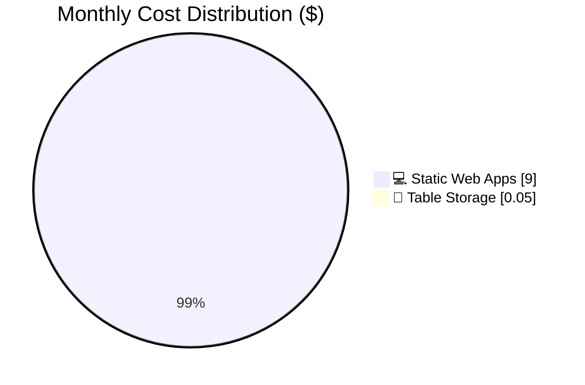

# Azure Cost Estimate: hacker-board


<details>
<summary><strong>📑 Table of Contents</strong></summary>

- [💰 Cost At-a-Glance](#-cost-at-a-glance)
- [✅ Decision Summary](#-decision-summary)
- [🔁 Requirements → Cost Mapping](#-requirements--cost-mapping)
- [📊 Top 5 Cost Drivers](#-top-5-cost-drivers)
- [Architecture Overview](#architecture-overview)
- [🧾 What We Are Not Paying For (Yet)](#-what-we-are-not-paying-for-yet)
- [⚠️ Cost Risk Indicators](#-cost-risk-indicators)
- [🎯 Quick Decision Matrix](#-quick-decision-matrix)
- [💰 Savings Opportunities](#-savings-opportunities)
- [Detailed Cost Breakdown](#detailed-cost-breakdown)
- [References](#references)

</details>

> Generated by architect agent | 2026-02-11

| ⬅️ Previous                                                    | 📑 Index            | Next ➡️                                                      |
| -------------------------------------------------------------- | ------------------- | ------------------------------------------------------------ |
| [02-architecture-assessment.md](02-architecture-assessment.md) | [README](README.md) | [04-governance-constraints.md](04-governance-constraints.md) |

**Generated**: 2026-02-11
**Region**: westeurope (all resources — single region)
**Environment**: Production
**MCP Tools Used**: azure_price_search, azure_cost_estimate
**Architecture Reference**: [02-architecture-assessment.md](02-architecture-assessment.md)

## 💰 Cost At-a-Glance

> **Monthly Total: ~$9.05** | Annual: ~$108.60
>
> ```
> Budget: $50/month (soft) | Utilization: 18% ($9.05 of $50)
> ```
>
> | Status            | Indicator                                                         |
> | ----------------- | ----------------------------------------------------------------- |
> | Cost Trend        | ➡️ Stable                                                         |
> | Savings Available | 💰 $108/year if downgraded to Free tier (loses custom auth + SLA) |
> | Compliance        | ✅ GDPR-aligned (EU regions, minimal PII)                         |

## ✅ Decision Summary

- ✅ **Approved now**: Azure Static Web Apps Standard ($9/mo) + Table Storage LRS (~$0.05/mo) — complete solution with auth, API, CDN, and persistence
- ⏳ **Deferred**: Application Insights, Key Vault, GRS storage, private endpoints, Azure Monitor alerts
- 🔁 **Redesign trigger**: If >200 concurrent users, multi-event support, or >1 GB data → re-evaluate Container Apps or App Service

**Confidence**: High | **Expected Variance**: ±5% (pricing is fixed-rate for SWA Standard; Table Storage usage is negligible)

## 🔁 Requirements → Cost Mapping

| Requirement                | Architecture Decision          | Cost Impact                           | Mandatory |
| -------------------------- | ------------------------------ | ------------------------------------- | --------- |
| GitHub authentication (F5) | SWA Standard (custom auth)     | $9.00/mo (base cost)                  | Yes       |
| SLA 99.9%                  | SWA Standard (SLA included)    | $0 incremental (included in Standard) | Yes       |
| Score persistence          | Azure Table Storage (LRS)      | ~$0.05/mo                             | Yes       |
| < 2s response time         | SWA CDN + managed Functions    | $0 incremental (included)             | Yes       |
| "Deploy to Azure" button   | ARM template export from Bicep | $0 (tooling only)                     | Yes       |
| HTTPS-only, TLS 1.2        | SWA default + Storage config   | $0 incremental (default)              | Yes       |
| RTO 4h / RPO 1h            | Manual backup procedure        | $0 (operational process)              | No        |

## 📊 Top 5 Cost Drivers

| Rank | Resource                         | Monthly Cost | % of Total | Trend        |
| ---- | -------------------------------- | ------------ | ---------- | ------------ |
| 1️⃣   | Azure Static Web Apps (Standard) | $9.00        | 99.4%      | ➡️ Stable    |
| 2️⃣   | Azure Table Storage (data)       | ~$0.045      | 0.5%       | ➡️ Stable    |
| 3️⃣   | Table Storage (transactions)     | ~$0.004      | <0.1%      | ➡️ Stable    |
| 4️⃣   | Bandwidth (if >100 GB)           | $0.00        | 0%         | 🟢 Included  |
| 5️⃣   | Application Insights (optional)  | $0.00        | 0%         | 🟢 Free tier |

> 💡 **Quick Win**: This architecture is already near-minimum cost. The only cheaper option is SWA Free tier ($0) but that loses custom auth, SLA, and managed Functions flexibility.

<details>
<summary><strong>Cost Driver Details</strong></summary>

#### 1️⃣ Azure Static Web Apps (Standard)

| Aspect            | Detail                                           |
| ----------------- | ------------------------------------------------ |
| Current SKU       | Standard                                         |
| Monthly Cost      | $9.00                                            |
| Cost Breakdown    | Fixed rate: $9.00/app/month                      |
| Optimization      | Downgrade to Free tier (loses custom auth + SLA) |
| Potential Savings | $9.00/month                                      |

#### 2️⃣ Azure Table Storage

| Aspect            | Detail                    |
| ----------------- | ------------------------- |
| Current SKU       | Standard LRS              |
| Monthly Cost      | ~$0.05                    |
| Optimization      | None — already at minimum |
| Potential Savings | $0/month                  |

</details>

## Architecture Overview

### Cost Distribution



### Key Design Decisions Affecting Cost

| Decision                          | Cost Impact     | Business Rationale                                      | Status   |
| --------------------------------- | --------------- | ------------------------------------------------------- | -------- |
| SWA Standard over Free            | +$9.00/mo       | Required for custom GitHub auth + SLA                   | Required |
| Table Storage over Cosmos DB      | -$25+/mo saved  | Simple key-value data, no global distribution needed    | Required |
| LRS over GRS                      | -$0.04/mo saved | Event data is non-critical, local redundancy sufficient | Accepted |
| Managed Functions over standalone | -$0/mo saved    | Included in SWA, no separate Function App billing       | Required |
| No Key Vault                      | -$0.03/mo saved | Few secrets, SWA app settings encrypted at rest         | Accepted |
| No Application Insights           | $0 saved        | Free tier available, recommend enabling                 | Deferred |

## 🧾 What We Are Not Paying For (Yet)

| Feature                                   | Est. Additional Cost   | When to Add                                   |
| ----------------------------------------- | ---------------------- | --------------------------------------------- |
| Azure Key Vault (Standard)                | +$0.03/mo              | If secrets rotation or audit trail required   |
| Application Insights (beyond 5 GB)        | +$2.30/GB/mo           | If log volume exceeds free tier (unlikely)    |
| Storage GRS (geo-redundant)               | +$0.04/mo              | If event data must survive datacenter failure |
| Enterprise Edge (Azure Front Door on SWA) | +$17.52/mo             | If global low-latency or advanced DDoS needed |
| Private Endpoints                         | +$7.20/mo per endpoint | If network isolation required                 |
| Azure Monitor Alerts                      | +$0.10/alert/mo        | If proactive alerting desired                 |
| Multi-region deployment                   | +$9+/mo                | If cross-region failover required             |

## ⚠️ Cost Risk Indicators

| Resource                   | Risk Level | Issue                                       | Mitigation                                    |
| -------------------------- | ---------- | ------------------------------------------- | --------------------------------------------- |
| SWA Bandwidth              | 🟢 Low     | 100 GB included; overage at $0.20/GB        | 50 users × small payloads = <1 GB/mo total    |
| Table Storage transactions | 🟢 Low     | Billed per 10K transactions at $0.00036     | Event usage ≈ few hundred transactions total  |
| Function executions        | 🟢 Low     | Consumption plan free grant: 1M executions  | Event usage ≈ few thousand executions         |
| Forgotten resources        | 🟡 Medium  | Resources continue billing after event ends | Set calendar reminder to delete RG post-event |

> **⚠️ Watch Item**: The biggest budget risk is forgetting to clean up resources after the microhack ends. Set a $15/mo budget alert and document the cleanup procedure.

## 🎯 Quick Decision Matrix

_"If you need X, expect to pay Y more"_

| Requirement                | Additional Cost | SKU Change              | Notes                                    |
| -------------------------- | --------------- | ----------------------- | ---------------------------------------- |
| Custom auth (GitHub OAuth) | +$9.00/mo       | SWA Free → Standard     | Already included                         |
| Geo-redundant storage      | +$0.04/mo       | LRS → GRS               | Change 1 Bicep parameter                 |
| Key Vault for secrets      | +$0.03/mo       | Add Key Vault Standard  | Add AVM module                           |
| Enterprise DDoS/CDN        | +$17.52/mo      | Add Enterprise Edge     | SWA add-on                               |
| Application Insights       | +$0.00/mo       | Free tier, 5 GB/mo      | Add Log Analytics + App Insights modules |
| Multi-region failover      | +$9.05+/mo      | Duplicate SWA + Storage | Significant re-architecture              |
| Private endpoint (Storage) | +$7.20/mo       | Add PE resource         | Requires VNET                            |

## 💰 Savings Opportunities

> ### Total Potential Savings: $108/year
>
> | Strategy              | Monthly Savings | Annual Savings | Trade-off                                   |
> | --------------------- | --------------- | -------------- | ------------------------------------------- |
> | Downgrade to SWA Free | $9.00           | $108.00        | Lose custom auth, SLA, staging environments |

### Additional Optimization Strategies

| Strategy                     | Potential Savings | Effort | Notes                                          |
| ---------------------------- | ----------------- | ------ | ---------------------------------------------- |
| Delete resources after event | $9.05/mo ongoing  | 🟢 Low | `az group delete` — documented in deploy.ps1   |
| Use SWA Free tier            | $9.00/mo          | 🟢 Low | Only if built-in auth providers sufficient     |
| Skip Application Insights    | $0/mo             | 🟢 Low | Already excluded; free tier available if added |

> **Note**: This architecture is already at near-minimum cost. The primary savings opportunity is resource cleanup after the microhack event concludes.

## Detailed Cost Breakdown

### 💻 Compute Services

| Resource                  | SKU         | Qty | $/Month | Notes                                             |
| ------------------------- | ----------- | --- | ------- | ------------------------------------------------- |
| Azure Static Web Apps     | Standard    | 1   | $9.00   | Includes managed Functions, CDN, SSL, custom auth |
| Azure Functions (Managed) | Consumption | 1   | $0.00   | Included in SWA Standard plan                     |

**💻 Compute Subtotal**: ~$9.00/month

### 💾 Data Services

| Resource           | SKU          | Qty | $/Month | Notes                               |
| ------------------ | ------------ | --- | ------- | ----------------------------------- |
| Storage Account    | Standard LRS | 1   | ~$0.045 | <1 GB Table Storage at $0.045/GB/mo |
| Table transactions | Standard LRS | ~1K | ~$0.004 | $0.00036 per 10K transactions       |

**💾 Data Subtotal**: ~$0.05/month

### 🌐 Networking

| Resource      | SKU             | Qty | $/Month | Notes                            |
| ------------- | --------------- | --- | ------- | -------------------------------- |
| SWA Bandwidth | Included 100 GB | 1   | $0.00   | Overage: $0.20/GB (not expected) |

**🌐 Networking Subtotal**: $0.00/month

### 🔐 Security / Management

| Resource        | SKU          | Qty | $/Month | Notes                 |
| --------------- | ------------ | --- | ------- | --------------------- |
| GitHub OAuth    | SWA built-in | 1   | $0.00   | Included in SWA       |
| TLS Certificate | SWA managed  | 1   | $0.00   | Free auto-renewed SSL |

**🔐 Security Subtotal**: $0.00/month

### 📋 Monthly Cost Summary

| Category                 | Monthly Cost | % of Total |
| ------------------------ | ------------ | ---------- |
| 💻 Compute               | $9.00        | 99.4%      |
| 💾 Data Services         | $0.05        | 0.6%       |
| 🌐 Networking            | $0.00        | 0%         |
| 🔐 Security / Management | $0.00        | 0%         |
| **Total**                | **$9.05**    | **100%**   |

```
Cost Distribution:
💻 Compute          ████████████████████████████████████████ $9.00 (99.4%)
💾 Data Services    ▏                                        $0.05  (0.6%)
🌐 Networking       ▏                                        $0.00  (0.0%)
🔐 Security         ▏                                        $0.00  (0.0%)
```

### 🧮 Base Run Cost vs Growth-Variable Cost

| Cost Type        | Drivers                  | Examples                  | How It Scales                                       |
| ---------------- | ------------------------ | ------------------------- | --------------------------------------------------- |
| Base run (fixed) | SWA Standard plan        | $9.00/mo flat fee         | Step-change only if adding Enterprise Edge          |
| Growth-variable  | Storage usage, bandwidth | Table data, API bandwidth | Linear with data/traffic — negligible at this scale |

### 🔧 Environment Strategy (FinOps)

- **Production**: Single SWA Standard instance + Storage LRS. No HA beyond platform defaults.
- **Non-prod**: Not applicable (single environment). If added later, use SWA Free tier for dev/test.

### 🛡️ Cost Guardrails

| Guardrail          | Threshold                    | Action                                      |
| ------------------ | ---------------------------- | ------------------------------------------- |
| Budget alert       | $15/mo (80%) / $50/mo (100%) | Notify owner via email                      |
| Bandwidth          | >100 GB/mo                   | Investigate — likely anomalous for 50 users |
| Table Storage      | >1 GB                        | Review data retention / cleanup             |
| Post-event cleanup | Event end + 30 days          | Delete resource group                       |

### 📝 Testable Assumptions

| Assumption              | Why It Matters                    | How to Measure           | Threshold / Trigger               |
| ----------------------- | --------------------------------- | ------------------------ | --------------------------------- |
| Bandwidth <10 GB/mo     | Stays within free 100 GB          | SWA metrics              | >50 GB/mo → investigate           |
| Table Storage <1 GB     | Keeps storage costs at ~$0        | Storage metrics          | >1 GB → review data model         |
| API calls <1M/mo        | Stays within Functions free grant | Function execution count | >500K → monitor closely           |
| Event duration <30 days | Limits total spend to ~$9         | Calendar/timeline        | >30 days → confirm continued need |

### 📊 Pricing Data Accuracy

> **📊 Data Source**: Prices retrieved from Azure Static Web Apps pricing page and Azure Retail Prices API via Azure Pricing MCP
>
> ✅ **Included**: Retail list prices (PAYG), verified against official pricing page
>
> ❌ **Not Included**: EA discounts, CSP pricing, negotiated rates, Azure Hybrid Benefit
>
> 💡 For official quotes, validate with [Azure Pricing Calculator](https://azure.microsoft.com/pricing/calculator/)
>
> 📅 **Prices queried**: 2026-02-11
> 📐 **Usage basis**: 730 hours/month, <1 GB data, <10K transactions, <50 users

## References

- [Azure Static Web Apps Pricing](https://azure.microsoft.com/pricing/details/app-service/static/)
- [Azure Table Storage Pricing](https://azure.microsoft.com/pricing/details/storage/tables/)
- [Azure Functions Pricing](https://azure.microsoft.com/pricing/details/functions/)
- [Azure Pricing Calculator](https://azure.microsoft.com/pricing/calculator/)
- [Azure Retail Prices API](https://learn.microsoft.com/rest/api/cost-management/retail-prices/azure-retail-prices)
- [02-architecture-assessment.md](02-architecture-assessment.md)
- [01-requirements.md](01-requirements.md)

---

| ⬅️ [02-architecture-assessment.md](02-architecture-assessment.md) | 🏠 [Project Index](README.md) | ➡️ [04-governance-constraints.md](04-governance-constraints.md) |
| ----------------------------------------------------------------- | ----------------------------- | --------------------------------------------------------------- |
