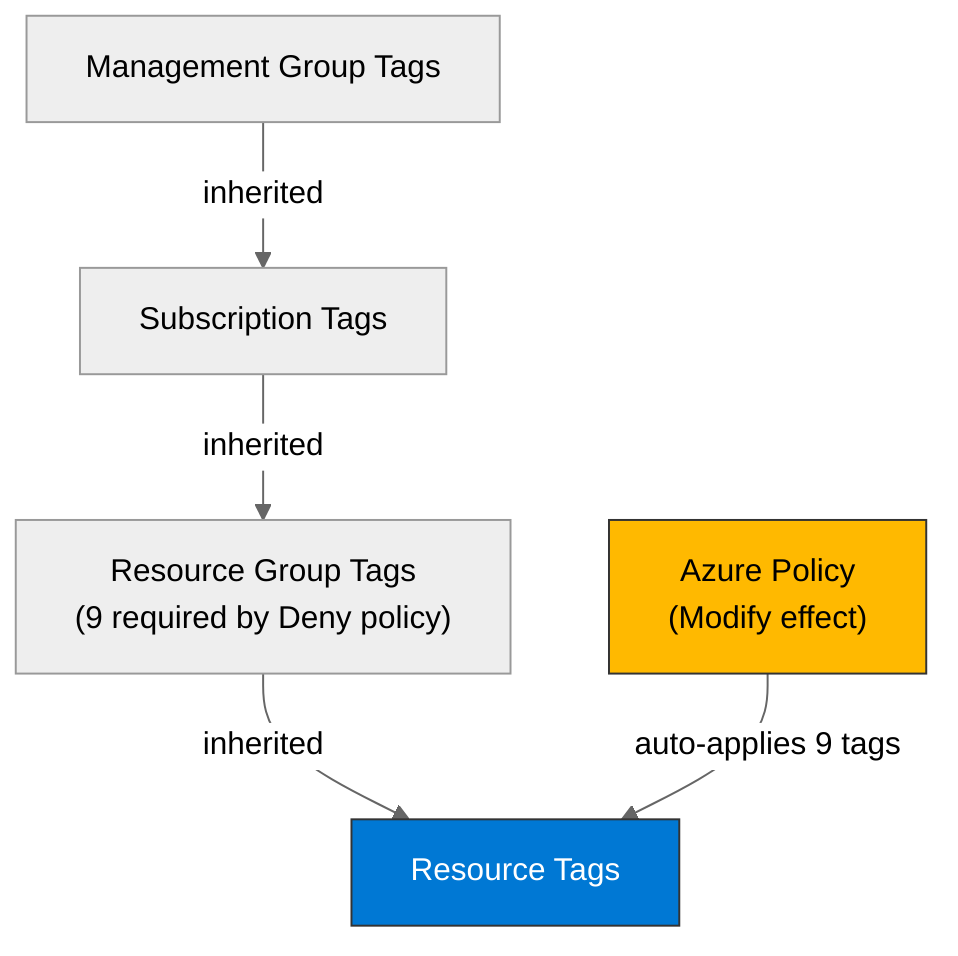

# Governance Constraints - hacker-board


<details>
<summary><strong>📑 Table of Contents</strong></summary>

- [Discovery Source](#discovery-source)
- [Azure Policy Compliance](#azure-policy-compliance)
- [Plan Adaptations Based on Policies](#plan-adaptations-based-on-policies)
- [Deployment Blockers](#deployment-blockers)
- [Required Tags](#required-tags)
- [Security Policies](#security-policies)
- [Cost Policies](#cost-policies)
- [Network Policies](#network-policies)
- [References](#references)

</details>

> Generated by bicep-plan agent | 2026-02-12

| ⬅️ Previous                                        | 📑 Index            | Next ➡️                                                |
| -------------------------------------------------- | ------------------- | ------------------------------------------------------ |
| [03-des-cost-estimate.md](03-des-cost-estimate.md) | [README](README.md) | [04-implementation-plan.md](04-implementation-plan.md) |

This document captures the governance constraints and Azure Policy requirements
that must be addressed in the Bicep implementation.

## Discovery Source

> [!IMPORTANT]
> Governance constraints discovered from Azure REST API, not assumed.

| Query              | Results                            | Timestamp            |
| ------------------ | ---------------------------------- | -------------------- |
| Policy Assignments | 20 policies discovered             | 2026-02-12T00:00:00Z |
| Tag Policies       | 9 tags required on resource groups | 2026-02-12T00:00:00Z |
| Security Policies  | 11 deny constraints (MCAPSGov)     | 2026-02-12T00:00:00Z |

**Discovery Method**: Azure REST API (`/providers/Microsoft.Authorization/policyAssignments?api-version=2022-06-01`)
**Subscription**: noalz (`00858ffc-dded-4f0f-8bbf-e17fff0d47d9`)
**Scope**: Subscription + Management Group `2d04cb4c-999b-4e60-a3a7-e8993edc768b` (inherited)

> [!NOTE]
> 20 total policy assignments discovered: 12 subscription-scoped, 8 management group-inherited.
> REST API used instead of `az policy assignment list` to capture management group-inherited policies.

### Policy Definition Analysis

> [!IMPORTANT]
> **MANDATORY**: For all Deny and DeployIfNotExists policies, analysis of policy definition JSON (policyRule) was performed.

| Policy Display Name                 | Assignment Scope | Effect | Actually Blocks                                                                                                                                                                                                                | Evidence from policyRule.if                                                                                                                                                                                                                                                                                                                                                                                               |
| ----------------------------------- | ---------------- | ------ | ------------------------------------------------------------------------------------------------------------------------------------------------------------------------------------------------------------------------------ | ------------------------------------------------------------------------------------------------------------------------------------------------------------------------------------------------------------------------------------------------------------------------------------------------------------------------------------------------------------------------------------------------------------------------- |
| Block Azure RM Resource Creation    | Management Group | Deny   | Classic resources only                                                                                                                                                                                                         | `anyOf` with 7 conditions: `Microsoft.ClassicCompute/*`, `Microsoft.ClassicStorage/*`, `Microsoft.ClassicNetwork/*`, `Microsoft.MarketplaceApps/classicDevServices`. Also requires `ringValue` tag on RG.                                                                                                                                                                                                                 |
| MCAPSGov Deny Policies (initiative) | Management Group | Deny   | VM SKUs (H/M/N series), AKS node count, VMSS node count, OpenAI provisioned capacity, Sentinel commitment, SQL without AAD-only auth, SQL MI without AAD-only auth, Not Allowed Resource Types, Key Vault HSM purge protection | 11 individual policies in set — none block SWA, Storage, App Insights, or Log Analytics                                                                                                                                                                                                                                                                                                                                   |
| JV-Enforce Resource Group Tags v3   | Management Group | Deny   | RG creation without all 9 required tags                                                                                                                                                                                        | `allOf`: type == `Microsoft.Resources/subscriptions/resourceGroups` AND missing any of: `environment`, `owner`, `costcenter`, `application`, `workload`, `sla`, `backup-policy`, `maint-window`, `technical-contact`. Excludes: `AzureBackupRG*`, `ResourceMover*`, `databricks-rg*`, `NetworkWatcherRG`, `microsoft-network`, `LogAnalyticsDefaultResources`, `rg-amba-*`, `DynamicsDeployments*`, `MC_myResourceGroup*` |
| MFA for Resource Write Actions      | Management Group | Deny   | Write operations without MFA                                                                                                                                                                                                   | Azure built-in — enforces MFA for ARM write operations                                                                                                                                                                                                                                                                                                                                                                    |
| MFA for Resource Delete Actions     | Management Group | Deny   | Delete operations without MFA                                                                                                                                                                                                  | Azure built-in — enforces MFA for ARM delete operations                                                                                                                                                                                                                                                                                                                                                                   |

**Analysis Notes**:

- "Block Azure RM Resource Creation" initially flagged as a potential blocker but **cleared** after JSON analysis — it only blocks Classic (ASM) resource types, not ARM resources
- MCAPSGov Deny Policies contains "Not Allowed Resource Types" but the assignment has **no parameter overrides** — uses default empty list, so no resource types are blocked
- SQL AAD-only auth deny is **not relevant** — this project uses Table Storage, not Azure SQL
- MFA enforcement is a tenant-level control handled at authentication time, not at Bicep deployment level

## Azure Policy Compliance

| Category       | Constraint                           | Implementation                                                     | Status            |
| -------------- | ------------------------------------ | ------------------------------------------------------------------ | ----------------- |
| Tagging        | 9 required tags on resource groups   | Include all 9 tags in RG deployment                                | ✅ Compliant      |
| Tagging        | Tag inheritance from RG to resources | Automatic via `JV - Inherit Multiple Tags from RG` (Modify effect) | ✅ Auto-applied   |
| Security       | Classic resource types blocked       | Not using any Classic types                                        | ✅ Not applicable |
| Security       | SQL AAD-only authentication          | Not using Azure SQL                                                | ✅ Not applicable |
| Security       | VM SKU restrictions (H/M/N series)   | Not using VMs                                                      | ✅ Not applicable |
| Data Residency | GDPR 2016/679 compliance initiative  | EU region (westeurope)                                             | ✅ Compliant      |
| Compliance     | PCI DSS v4 initiative                | Audit-only (no deny effect)                                        | ⚠️ Audit          |
| Security       | Azure Security Baseline initiative   | Audit-only — storage/HTTPS checks                                  | ⚠️ Audit          |

> [!NOTE]
> No ❌ items detected. All constraints are either compliant or audit-only (non-blocking).

## Plan Adaptations Based on Policies

> [!NOTE]
> This section documents how the implementation plan was adapted to comply with discovered Azure Policies.

### Architectural Changes

✅ Original architecture complies with all discovered Deny policies. No architectural changes required.

| Original Design | Blocking Policy | Effect | Adaptation Applied                                                                               |
| --------------- | --------------- | ------ | ------------------------------------------------------------------------------------------------ |
| N/A             | N/A             | N/A    | No adaptations needed — SWA, Storage, App Insights, Log Analytics are all allowed resource types |

### Auto-Applied Resources

| Policy                                                      | Effect            | Auto-Applied Resource                                   |
| ----------------------------------------------------------- | ----------------- | ------------------------------------------------------- |
| MCAPSGov Deploy Policies — `NewStorageAccountDeploy`        | DeployIfNotExists | May auto-configure storage compliance settings          |
| MCAPSGov Deploy Policies — `ModifyAllowBlobAnonymousAccess` | Modify            | Sets `allowBlobPublicAccess: false` on storage accounts |
| MCAPSGov Deploy Policies — `StorageAccountDisableLocalAuth` | Modify            | Disables shared key access on storage accounts          |

> [!WARNING]
> The `StorageAccountDisableLocalAuth` policy will disable shared key/connection string access.
> SWA managed Functions must use managed identity or SAS-based access to Table Storage.
> The Bicep templates will set `allowSharedKeyAccess: false` explicitly to align with this policy.

### Auto-Modified Configurations

| Policy                                             | Effect | Auto-Applied Change                                          |
| -------------------------------------------------- | ------ | ------------------------------------------------------------ |
| JV - Inherit Multiple Tags from RG                 | Modify | 9 tags auto-inherited from resource group to child resources |
| MCAPSGov Deploy — `ModifyAllowBlobAnonymousAccess` | Modify | `allowBlobPublicAccess` set to `false`                       |

## Deployment Blockers

> [!CAUTION]
> **CRITICAL**: Resource group tag policy is a deployment blocker if tags are missing.

### JV-Enforce Resource Group Tags v3

- **Policy ID**: `27833bcf-5909-4a37-891c-16a3cb06856d`
- **Effect**: Deny
- **Scope**: Management Group (inherited)
- **Enforcement Mode**: Default
- **Impact**: Resource group creation fails without ALL 9 required tags
- **Assessment Date**: 2026-02-12

**Resolution**: ✅ **RESOLVED** — Bicep templates will include all 9 required tags as parameters.

The 9 required tags are:

| #   | Tag Key             | Parameter Source                                 |
| --- | ------------------- | ------------------------------------------------ |
| 1   | `environment`       | `environment` parameter (default: `prod`)        |
| 2   | `owner`             | `owner` parameter (default: `agentic-infraops`)  |
| 3   | `costcenter`        | `costCenter` parameter                           |
| 4   | `application`       | `hacker-board` (hardcoded from project name) |
| 5   | `workload`          | `hacker-board` (hardcoded)                   |
| 6   | `sla`               | `99.9%` (from requirements)                      |
| 7   | `backup-policy`     | `none` (event-scoped, no backup required)        |
| 8   | `maint-window`      | `sat-02-06-utc` (weekend maintenance)            |
| 9   | `technical-contact` | `technicalContact` parameter                     |

> [!IMPORTANT]
> The original architecture assessment listed 4 tags (`Environment`, `ManagedBy`, `Project`, `Owner`).
> The actual Azure Policy requires **9 tags** with **different key names** (lowercase, no `ManagedBy`/`Project`).
> The Bicep plan has been adapted accordingly.

## Required Tags

All resources must include the following tags on the **resource group** (child resources inherit via Modify policy):

```bicep
tags: {
  environment: environment
  owner: owner
  costcenter: costCenter
  application: 'hacker-board'
  workload: 'hacker-board'
  sla: '99.9%'
  'backup-policy': 'none'
  'maint-window': 'sat-02-06-utc'
  'technical-contact': technicalContact
}
```



## Security Policies

| Policy               | Requirement                                                                |
| -------------------- | -------------------------------------------------------------------------- |
| HTTPS Only           | ✅ SWA enforces HTTPS by default; Storage `supportsHttpsTrafficOnly: true` |
| TLS Version          | ✅ `minimumTlsVersion: 'TLS1_2'` on Storage Account                        |
| Public Access        | ✅ `allowBlobPublicAccess: false` (also auto-enforced by MCAPSGov Modify)  |
| Managed Identity     | ⚠️ SWA managed Functions — consider managed identity for Storage access    |
| Shared Key Access    | ✅ `allowSharedKeyAccess: false` (auto-enforced by MCAPSGov Modify)        |
| Key Vault            | ⚠️ Not required for this workload (no secrets beyond SWA app settings)     |
| MFA for Write/Delete | ✅ Enforced at tenant level — transparent to Bicep deployment              |

## Cost Policies

| Policy            | Constraint                                                                       |
| ----------------- | -------------------------------------------------------------------------------- |
| Budget            | No budget policy detected — recommend setting $15/mo resource group budget alert |
| SKU Restrictions  | VM H/M/N series blocked (not applicable — no VMs in this workload)               |
| Reserved Capacity | No reserved capacity policies (not applicable for consumption-based services)    |

## Network Policies

| Policy            | Constraint                                                                            |
| ----------------- | ------------------------------------------------------------------------------------- |
| Private Endpoints | No private endpoint requirement detected                                              |
| VNet Integration  | No VNet integration requirement detected                                              |
| Public Endpoints  | No public endpoint restrictions for SWA or Storage (audit-only via Security Baseline) |

---

## References

| Topic                | Link                                                                                                                       |
| -------------------- | -------------------------------------------------------------------------------------------------------------------------- |
| Azure Policy         | [Overview](https://learn.microsoft.com/azure/governance/policy/overview)                                                   |
| Azure Resource Graph | [ARG Overview](https://learn.microsoft.com/azure/governance/resource-graph/overview)                                       |
| Tag Governance       | [Tagging Strategy](https://learn.microsoft.com/azure/cloud-adoption-framework/ready/azure-best-practices/resource-tagging) |
| MCAPSGov Policies    | [MCAPS Policy Wiki](https://aka.ms/AzPolicyWiki)                                                                           |
| GDPR Compliance      | [Azure GDPR Guidance](https://learn.microsoft.com/azure/compliance/offerings/offering-eu-gdpr)                             |

---

_Governance constraints discovered from Azure REST API._
_See [governance-discovery.instructions.md](/.github/instructions/governance-discovery.instructions.md) for discovery methodology._

---

| ⬅️ [03-des-cost-estimate.md](03-des-cost-estimate.md) | 🏠 [Project Index](README.md) | ➡️ [04-implementation-plan.md](04-implementation-plan.md) |
| ----------------------------------------------------- | ----------------------------- | --------------------------------------------------------- |
