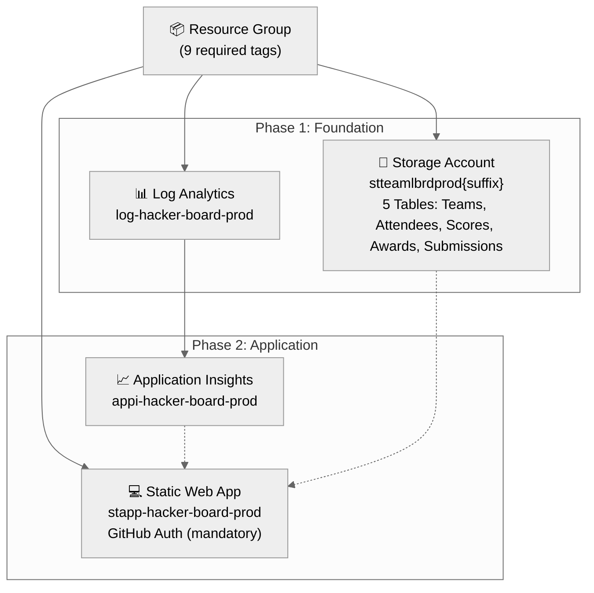
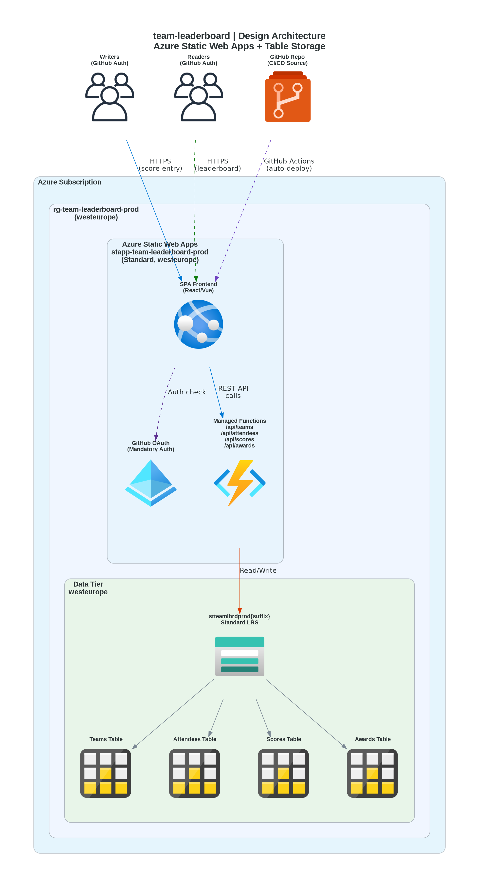
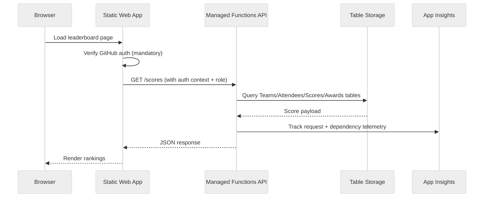

# Step 4: Implementation Plan - hacker-board


<details>
<summary><strong>📑 Table of Contents</strong></summary>

- [Overview](#overview)
- [Resource Inventory](#resource-inventory)
- [Module Structure](#module-structure)
- [Implementation Tasks](#implementation-tasks)
- [Deployment Phases](#deployment-phases)
- [Dependency Graph](#dependency-graph)
- [Naming Conventions](#naming-conventions)
- [Security Configuration](#security-configuration)
- [Estimated Implementation Time](#estimated-implementation-time)
- [Approval Gate](#approval-gate)
- [References](#references)

</details>

> Generated by bicep-plan agent | 2026-02-12

| ⬅️ Previous                                                  | 📑 Index            | Next ➡️                                        |
| ------------------------------------------------------------ | ------------------- | ---------------------------------------------- |
| [04-governance-constraints.md](04-governance-constraints.md) | [README](README.md) | [04-preflight-check.md](04-preflight-check.md) |

## Overview

Implement a serverless microhack scoring dashboard using Azure Static Web Apps (Standard) with managed Functions API and Azure Table Storage. All resources deploy to `westeurope` (single region) with optional Application Insights + Log Analytics for observability.

**Key governance finding**: Resource groups require **9 tags** (not the standard 4) — enforced by `JV-Enforce Resource Group Tags v3` Deny policy. Additionally, `StorageAccountDisableLocalAuth` Modify policy will auto-disable shared key access, requiring managed identity or SAS-based auth for SWA→Storage communication.

---

## Resource Inventory

| Resource                | Type                                       | SKU          | AVM Module                                            | Version | Dependencies   | Status  |
| ----------------------- | ------------------------------------------ | ------------ | ----------------------------------------------------- | ------- | -------------- | ------- |
| Resource Group          | `Microsoft.Resources/resourceGroups`       | N/A          | N/A (deployment scope)                                | —       | None           | ⬜ Todo |
| Log Analytics Workspace | `Microsoft.OperationalInsights/workspaces` | PerGB2018    | ✅ `br/public:avm/res/operational-insights/workspace` | 0.15.0  | Resource Group | ⬜ Todo |
| Storage Account         | `Microsoft.Storage/storageAccounts`        | Standard_LRS | ✅ `br/public:avm/res/storage/storage-account`        | 0.31.0  | Resource Group | ⬜ Todo |

> [!NOTE]
> Storage Account includes Table Service with 5 tables: Teams, Attendees, Scores, Awards, Submissions.
> | Application Insights | `Microsoft.Insights/components` | N/A | ✅ `br/public:avm/res/insights/component` | 0.7.1 | Log Analytics | ⬜ Todo |
> | Static Web App | `Microsoft.Web/staticSites` | Standard | ✅ `br/public:avm/res/web/static-site` | 0.9.3 | Resource Group | ⬜ Todo |

> [!TIP]
> All 4 resources have AVM modules available. No raw Bicep resources needed.

---

## Module Structure

```
infra/bicep/hacker-board/
├── main.bicep                     # Orchestration — parameters, variables, module calls
├── main.bicepparam                # Parameter values file
├── modules/
│   ├── log-analytics.bicep        # Log Analytics Workspace (AVM)
│   ├── storage.bicep              # Storage Account + Table services (AVM)
│   ├── app-insights.bicep         # Application Insights (AVM)
│   └── static-web-app.bicep       # Static Web App (AVM)
└── deploy.ps1                     # Deployment script with what-if + validation
```

| Module               | AVM Source                                         | Version | Purpose                              |
| -------------------- | -------------------------------------------------- | ------- | ------------------------------------ |
| log-analytics.bicep  | `br/public:avm/res/operational-insights/workspace` | 0.15.0  | Centralized logging for App Insights |
| storage.bicep        | `br/public:avm/res/storage/storage-account`        | 0.31.0  | Table Storage for scoring data       |
| app-insights.bicep   | `br/public:avm/res/insights/component`             | 0.7.1   | API observability and diagnostics    |
| static-web-app.bicep | `br/public:avm/res/web/static-site`                | 0.9.3   | SPA hosting with managed Functions   |

---

## Implementation Tasks

### Task 1: main.bicep (Orchestration)

**Purpose**: Main entry point — defines parameters, shared variables, and orchestrates module deployments.

**Parameters**:

```yaml
- projectName: string = 'hacker-board'
- environment: string = 'prod'
- swaLocation: string = 'westeurope'
- storageLocation: string = 'westeurope'
- owner: string = 'agentic-infraops'
- costCenter: string # Required by RG tag policy
- technicalContact: string # Required by RG tag policy
- repositoryUrl: string = '' # GitHub repo URL for SWA
- repositoryBranch: string = 'main'
```

**Variables**:

```yaml
- uniqueSuffix: uniqueString(resourceGroup().id)  # Generated once, passed everywhere
- tags: object with all 9 required tags
- swaName: 'stapp-${projectName}-${environment}'
- storageName: 'st${take(replace(projectName, '-', ''), 8)}${take(environment, 3)}${take(uniqueSuffix, 6)}'
- logName: 'log-${projectName}-${environment}'
- appiName: 'appi-${projectName}-${environment}'
```

**Modules Called**:

1. log-analytics.bicep
2. storage.bicep
3. app-insights.bicep (depends on log-analytics output)
4. static-web-app.bicep

**Outputs**:

```yaml
- staticWebAppUrl: string # Default hostname
- staticWebAppName: string # For GitHub Actions config
- storageAccountName: string # For app configuration
- appInsightsConnectionString: string # For SWA app settings
```

### Task 2: modules/log-analytics.bicep

**Resources**:

- Log Analytics Workspace via AVM `operational-insights/workspace:0.15.0`

**Key Configuration**:

```yaml
- name: logName
- location: storageLocation (westeurope)
- sku: PerGB2018
- retentionInDays: 30 # Minimum for free tier
- dailyQuotaGb: 1 # Prevent runaway costs
- tags: inherited from main
```

**Outputs**:

- `workspaceId`: Resource ID (for App Insights linkage)
- `workspaceName`: Name

### Task 3: modules/storage.bicep

**Resources**:

- Storage Account via AVM `storage/storage-account:0.31.0`
- Table Service + 5 Tables (Teams, Attendees, Scores, Awards, Submissions)

**Key Configuration**:

```yaml
- name: storageName
- location: storageLocation (westeurope)
- kind: StorageV2
- skuName: Standard_LRS
- supportsHttpsTrafficOnly: true
- minimumTlsVersion: TLS1_2
- allowBlobPublicAccess: false
- allowSharedKeyAccess: false # MCAPSGov policy auto-enforces this
- tableServices:
    tables:
      - name: Teams
      - name: Attendees
      - name: Scores
      - name: Awards
- tags: inherited from main
```

> [!WARNING]
> `allowSharedKeyAccess: false` is set explicitly to comply with the `StorageAccountDisableLocalAuth` Modify policy.
> SWA managed Functions must authenticate to Storage via managed identity or SAS tokens.

**Outputs**:

- `storageAccountId`: Resource ID
- `storageAccountName`: Name
- `primaryEndpoints`: Table endpoint URL

### Task 4: modules/app-insights.bicep

**Resources**:

- Application Insights via AVM `insights/component:0.7.1`

**Key Configuration**:

```yaml
- name: appiName
- location: storageLocation (westeurope)
- kind: web
- applicationType: web
- workspaceResourceId: logAnalyticsWorkspaceId # From log-analytics output
- retentionInDays: 30
- tags: inherited from main
```

**Outputs**:

- `connectionString`: Application Insights connection string (for SWA app settings)
- `instrumentationKey`: Deprecated but may be needed for compatibility
- `appInsightsId`: Resource ID

### Task 5: modules/static-web-app.bicep

**Resources**:

- Static Web App via AVM `web/static-site:0.9.3`

**Key Configuration**:

```yaml
- name: swaName
- location: swaLocation (westeurope)
- sku: Standard
- repositoryUrl: repositoryUrl # Optional — can be linked later
- repositoryBranch: repositoryBranch
- appSettings:
    APPLICATIONINSIGHTS_CONNECTION_STRING: appInsightsConnectionString
    AZURE_STORAGE_ACCOUNT_NAME: storageAccountName
- tags: inherited from main
```

> [!NOTE]
> SWA Standard includes managed Functions (no separate Function App needed).
> GitHub OAuth is configured via `staticwebapp.config.json` in the app repo, not in Bicep.
> **All routes require authentication** — no anonymous access. Roles: `admin` and `member`.

**Outputs**:

- `staticWebAppUrl`: Default hostname (`*.azurestaticapps.net`)
- `staticWebAppName`: Resource name
- `staticWebAppId`: Resource ID
- `apiKey`: Deployment token (sensitive — for GitHub Actions)

### Task 6: deploy.ps1 (Deployment Script)

**Features**:

- Parameter validation (project name, environment, required tags)
- Azure login verification (`az account show`)
- Resource group creation with all 9 required tags
- Bicep lint and build verification
- What-If preview with user confirmation gate
- Phased deployment (Phase 1 → verify → Phase 2)
- Output display (SWA URL, storage name, connection strings)
- Error handling with rollback guidance

---

## Deployment Phases

> Deployment strategy: **Phased** (2 phases, chosen during planning)

### Phase 1: Foundation (Monitoring + Data)

| Order | Module              | Resources                    | Validation                                              |
| ----- | ------------------- | ---------------------------- | ------------------------------------------------------- |
| 0     | deploy.ps1          | Resource Group (with 9 tags) | `az group show` — verify tags present                   |
| 1     | log-analytics.bicep | Log Analytics Workspace      | Workspace provisioned, collecting data                  |
| 2     | storage.bicep       | Storage Account + 5 Tables   | Account created, tables accessible, shared key disabled |

**Approval Gate**: Verify foundation resources exist and are correctly configured before deploying application layer.

### Phase 2: Application (Compute + Observability)

| Order | Module               | Resources                 | Validation                           |
| ----- | -------------------- | ------------------------- | ------------------------------------ |
| 3     | app-insights.bicep   | Application Insights      | Connected to Log Analytics workspace |
| 4     | static-web-app.bicep | Static Web App (Standard) | SWA hosting, default URL accessible  |

**Approval Gate**: Verify SWA is accessible at default URL and App Insights is receiving telemetry.

### Phase Summary

| Phase           | Resources                    | Est. Deploy Time | Approval Gate                             |
| --------------- | ---------------------------- | ---------------- | ----------------------------------------- |
| 1 — Foundation  | RG + Log Analytics + Storage | ~3 min           | ✅ Verify tags, storage tables, workspace |
| 2 — Application | App Insights + SWA           | ~2 min           | ✅ Verify SWA URL, App Insights connected |

---

## Dependency Graph


[Dependency diagram source](./04-dependency-diagram.py)



> Solid arrows = hard dependencies (must deploy first). Dashed arrows = configuration references (connection strings passed as app settings).

---

## Runtime Flow Diagram



[Runtime flow source](./04-runtime-diagram.py)



---

## Naming Conventions

| Resource             | Pattern                  | Example                       | Generated Name                |
| -------------------- | ------------------------ | ----------------------------- | ----------------------------- |
| Resource Group       | `rg-{project}-{env}`     | `rg-hacker-board-prod`        | `rg-hacker-board-prod`        |
| Log Analytics        | `log-{project}-{env}`    | `log-hacker-board-prod`       | `log-hacker-board-prod`       |
| Storage Account      | `st{short}{env}{suffix}` | `stteamlbrdprod{6chars}`      | `stteamlbrdprodxxxxxx`        |
| Application Insights | `appi-{project}-{env}`   | `appi-hacker-board-prod`      | `appi-hacker-board-prod`      |
| Static Web App       | `stapp-{project}-{env}`  | `stapp-hacker-board-prod`     | `stapp-hacker-board-prod`     |

> [!NOTE]
> Storage Account name uses `take()` truncation to stay within 24-char limit:
> `st` (2) + `teamlbrd` (8) + `pro` (3) + `suffix` (6) = 19 chars.
> No hyphens allowed in Storage Account names.

---

## Security Configuration

| Resource             | Security Setting           | Value                                                                              |
| -------------------- | -------------------------- | ---------------------------------------------------------------------------------- |
| Storage Account      | `supportsHttpsTrafficOnly` | `true`                                                                             |
| Storage Account      | `minimumTlsVersion`        | `TLS1_2`                                                                           |
| Storage Account      | `allowBlobPublicAccess`    | `false`                                                                            |
| Storage Account      | `allowSharedKeyAccess`     | `false` (MCAPSGov enforced)                                                        |
| Storage Account      | Encryption                 | SSE with Microsoft-managed keys (AES-256)                                          |
| Static Web App       | HTTPS                      | Enforced by default (SWA platform)                                                 |
| Static Web App       | Authentication             | GitHub OAuth via SWA built-in auth — **mandatory, no anonymous access**            |
| Static Web App       | Roles                      | `admin` (full CRUD), `member` (view + own profile) via `staticwebapp.config.json` |
| Static Web App       | API Access                 | Functions accessible only through SWA reverse proxy                                |
| Application Insights | Connection                 | Uses connection string (not deprecated instrumentation key)                        |
| Log Analytics        | Data Retention             | 30 days (cost-optimized)                                                           |
| Log Analytics        | Daily Cap                  | 1 GB (prevents runaway ingestion costs)                                            |

---

## Estimated Implementation Time

| Task                          | Estimated Duration |
| ----------------------------- | ------------------ |
| main.bicep + parameters       | 15 minutes         |
| log-analytics.bicep module    | 10 minutes         |
| storage.bicep module          | 15 minutes         |
| app-insights.bicep module     | 10 minutes         |
| static-web-app.bicep module   | 15 minutes         |
| deploy.ps1 script             | 15 minutes         |
| Bicep lint + build validation | 5 minutes          |
| What-If dry run               | 5 minutes          |
| **Total**                     | **~90 minutes**    |

---

## Approval Gate

> [!IMPORTANT]
> **📋 Implementation Plan Ready**
>
> | Metric                           | Value                                                      |
> | -------------------------------- | ---------------------------------------------------------- |
> | Azure resources planned          | 5 (RG + 4 resources)                                       |
> | Bicep modules to create          | 4 (+ main.bicep + deploy.ps1)                              |
> | AVM modules used                 | 4/4 (100% AVM coverage)                                    |
> | Governance constraints addressed | ✅ 9-tag policy, shared key disabled, HTTPS enforced       |
> | CAF naming conventions applied   | ✅ All resources follow `{abbrev}-{project}-{env}` pattern |
> | Deployment strategy              | Phased (2 phases)                                          |
> | Estimated implementation time    | ~90 minutes                                                |
>
> - [ ] **Approved** — proceed to bicep-code
> - **Approver**: **\*\***\_\_\_**\*\***
> - **Date**: **\*\***\_\_\_**\*\***
>
> Reply **"approve"** to proceed to bicep-code, or provide feedback.

---

## References

> [!NOTE]
> 📚 The following Microsoft Learn resources inform this implementation.

| Topic                  | Link                                                                                                                          |
| ---------------------- | ----------------------------------------------------------------------------------------------------------------------------- |
| Azure Verified Modules | [AVM Index](https://aka.ms/avm/index)                                                                                         |
| Bicep Best Practices   | [Documentation](https://learn.microsoft.com/azure/azure-resource-manager/bicep/best-practices)                                |
| CAF Naming Conventions | [Naming Rules](https://learn.microsoft.com/azure/cloud-adoption-framework/ready/azure-best-practices/resource-naming)         |
| Resource Abbreviations | [Abbreviations](https://learn.microsoft.com/azure/cloud-adoption-framework/ready/azure-best-practices/resource-abbreviations) |
| SWA Authentication     | [SWA Auth Docs](https://learn.microsoft.com/azure/static-web-apps/authentication-authorization)                               |
| AVM Static Web App     | [Module README](https://github.com/Azure/bicep-registry-modules/tree/main/avm/res/web/static-site)                            |
| AVM Storage Account    | [Module README](https://github.com/Azure/bicep-registry-modules/tree/main/avm/res/storage/storage-account)                    |

---

_Plan generated by bicep-plan agent following Azure Well-Architected Framework guidelines._

---

| ⬅️ [04-governance-constraints.md](04-governance-constraints.md) | 🏠 [Project Index](README.md) | ➡️ [04-preflight-check.md](04-preflight-check.md) |
| --------------------------------------------------------------- | ----------------------------- | ------------------------------------------------- |
