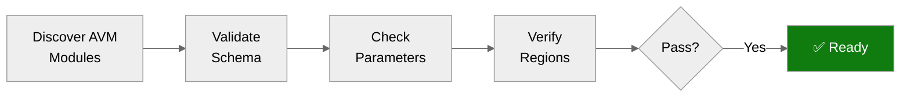

# Step 4b: Pre-Flight AVM Check - hacker-board

<strong>📑 Table of Contents</strong>

- [Purpose](#purpose)
- [AVM Schema Validation Results](#avm-schema-validation-results)
- [Parameter Type Analysis](#parameter-type-analysis)
- [Region Limitations Identified](#region-limitations-identified)
- [Pitfalls Checklist](#pitfalls-checklist)
- [Ready for Implementation](#ready-for-implementation)

> Generated by bicep-code agent | 2026-02-13
> Status: **PASS**

| ⬅️ Previous                                            | 📑 Index            | Next ➡️                                                          |
| ------------------------------------------------------ | ------------------- | ---------------------------------------------------------------- |
| [04-implementation-plan.md](04-implementation-plan.md) | [README](README.md) | [05-implementation-reference.md](05-implementation-reference.md) |

## Purpose

> [!IMPORTANT]
> This checkpoint validates AVM module schemas BEFORE Bicep code generation.

Prevents:

- Parameter type mismatches (string vs int)
- Deprecated parameter usage
- Region availability issues
- Object structure errors

## AVM Schema Validation Results

| Resource                | AVM Module Path                                    | Version | Latest | Status |
| ----------------------- | -------------------------------------------------- | ------- | ------ | ------ |
| Log Analytics Workspace | `br/public:avm/res/operational-insights/workspace` | 0.15.0  | 0.15.0 | ✅     |
| Storage Account         | `br/public:avm/res/storage/storage-account`        | 0.31.0  | 0.31.0 | ✅     |
| Application Insights    | `br/public:avm/res/insights/component`             | 0.7.1   | 0.7.1  | ✅     |
| Static Web App          | `br/public:avm/res/web/static-site`                | 0.9.3   | 0.9.3  | ✅     |

> All 4 planned modules are at latest available version. 100% AVM coverage.

## Parameter Type Analysis

<strong>Log Analytics Parameters</strong>

| Parameter       | Expected Type | Notes                               |
| --------------- | ------------- | ----------------------------------- |
| `name`          | `string`      | Standard                            |
| `location`      | `string`      | `westeurope`                        |
| `skuName`       | `string`      | `PerGB2018`                         |
| `dataRetention` | `int`         | Days (30)                           |
| `dailyQuotaGb`  | `int`         | NOT string — AVM pitfall documented |
| `tags`          | `object`      | 9 required tags                     |

<strong>Storage Account Parameters</strong>

| Parameter                  | Expected Type | Notes                              |
| -------------------------- | ------------- | ---------------------------------- |
| `name`                     | `string`      | Max 24 chars, no hyphens           |
| `location`                 | `string`      | `westeurope`                       |
| `kind`                     | `string`      | `StorageV2`                        |
| `skuName`                  | `string`      | `Standard_LRS`                     |
| `allowSharedKeyAccess`     | `bool`        | `false` — MCAPSGov policy enforces |
| `allowBlobPublicAccess`    | `bool`        | `false` — MCAPSGov policy enforces |
| `supportsHttpsTrafficOnly` | `bool`        | `true`                             |
| `minimumTlsVersion`        | `string`      | `TLS1_2`                           |
| `tableServices`            | `object`      | Contains `tables` array            |
| `tags`                     | `object`      | 9 required tags                    |

<strong>Application Insights Parameters</strong>

| Parameter             | Expected Type | Notes                     |
| --------------------- | ------------- | ------------------------- |
| `name`                | `string`      | Standard                  |
| `location`            | `string`      | `westeurope`              |
| `kind`                | `string`      | `web`                     |
| `applicationType`     | `string`      | `web`                     |
| `workspaceResourceId` | `string`      | From Log Analytics output |
| `tags`                | `object`      | 9 required tags           |

<strong>Static Web App Parameters</strong>

| Parameter          | Expected Type | Notes                                          |
| ------------------ | ------------- | ---------------------------------------------- |
| `name`             | `string`      | Standard                                       |
| `location`         | `string`      | `westeurope`                                   |
| `sku`              | `string`      | `Standard` (not Free — deployment reliability) |
| `repositoryUrl`    | `string`      | Optional GitHub repo URL                       |
| `repositoryBranch` | `string`      | `main`                                         |
| `appSettings`      | `object`      | Connection strings as key-value                |
| `tags`             | `object`      | 9 required tags                                |

## Region Limitations Identified

| Resource             | Target Region | Limitation               | Action                       |
| -------------------- | ------------- | ------------------------ | ---------------------------- |
| Static Web App       | `westeurope`  | Only 5 regions supported | ✅ `westeurope` is supported |
| Log Analytics        | `westeurope`  | No limitations           | ✅ Supported                 |
| Storage Account      | `westeurope`  | No limitations           | ✅ Supported                 |
| Application Insights | `westeurope`  | No limitations           | ✅ Supported                 |

> All resources deploy to `westeurope` — single region strategy. No region limitations for any planned resource.

## Pitfalls Checklist

Based on [Azure Defaults Skill](../../.github/skills/azure-defaults/SKILL.md):

- [x] Log Analytics `dailyQuotaGb` uses `int` type (not string)
- [x] Storage Account name has no hyphens, max 24 chars — using `take()` truncation
- [x] Storage Account `allowSharedKeyAccess: false` — aligned with MCAPSGov Modify policy
- [x] App Insights uses `APPLICATIONINSIGHTS_CONNECTION_STRING` (not deprecated instrumentation key)
- [x] Static Web App location set to `westeurope` (supported region)
- [x] Static Web App uses `Standard` SKU (not Free — ARM deployment reliability)

## Ready for Implementation

| Check                      | Status | Notes                                         |
| -------------------------- | ------ | --------------------------------------------- |
| All AVM modules verified   | ✅     | 4/4 at latest version                         |
| Parameter types confirmed  | ✅     | `dailyQuotaGb` as int verified                |
| Region limitations handled | ✅     | All resources in westeurope                   |
| Pitfalls addressed         | ✅     | Storage naming, shared key, connection string |

> [!IMPORTANT]
> **Go / No-Go Verdict**
>
> | Signal      | Status                |
> | ----------- | --------------------- |
> | AVM Modules | ✅ All 4 verified     |
> | Parameters  | ✅ Types confirmed    |
> | Regions     | ✅ westeurope for all |
> | Pitfalls    | ✅ All addressed      |
> | **Overall** | **✅ READY**          |

---

_Pre-flight validation for hacker-board Bicep implementation_

---

| ⬅️ [04-implementation-plan.md](04-implementation-plan.md) | 🏠 [Project Index](README.md) | ➡️ [05-implementation-reference.md](05-implementation-reference.md) |
| --------------------------------------------------------- | ----------------------------- | ------------------------------------------------------------------- |
