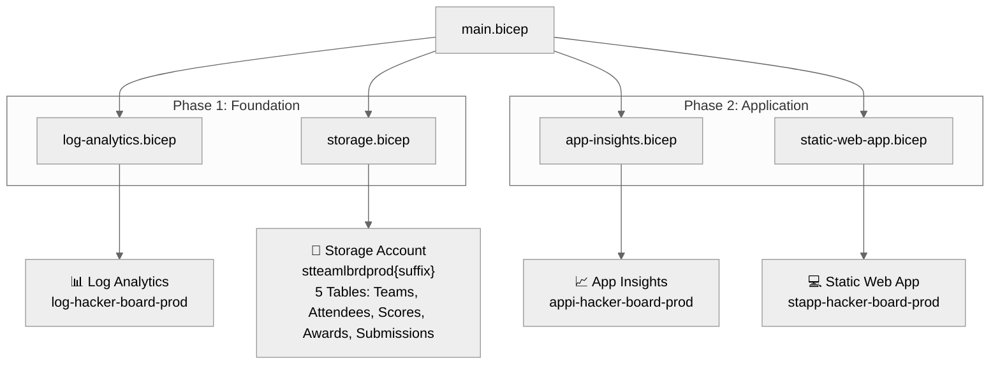

# Step 5: Implementation Reference - hacker-board


<details>
<summary><strong>📑 Table of Contents</strong></summary>

- [Bicep Templates Location](#bicep-templates-location)
- [File Structure](#file-structure)
- [Validation Status](#validation-status)
- [Resources Created](#resources-created)
- [Deployment Instructions](#deployment-instructions)
- [Key Implementation Notes](#key-implementation-notes)

</details>

> Generated by bicep-code agent | 2026-02-13

| ⬅️ Previous                                    | 📑 Index            | Next ➡️                                              |
| ---------------------------------------------- | ------------------- | ---------------------------------------------------- |
| [04-preflight-check.md](04-preflight-check.md) | [README](README.md) | [06-deployment-summary.md](06-deployment-summary.md) |

## Bicep Templates Location

📁 **Code Location**: [`infra/bicep/hacker-board/`](../../infra/bicep/hacker-board/)

## File Structure

```
infra/bicep/hacker-board/
├── main.bicep              # Orchestration — parameters, variables, phased module calls
├── main.bicepparam         # Parameter file (prod defaults)
├── deploy.ps1              # PowerShell deployment script with phased deployment
└── modules/
    ├── log-analytics.bicep # AVM: operational-insights/workspace:0.15.0
    ├── storage.bicep       # AVM: storage/storage-account:0.31.0 (5 tables)
    ├── app-insights.bicep  # AVM: insights/component:0.7.1
    └── static-web-app.bicep # AVM: web/static-site:0.9.3 (Standard SKU)
```

## Validation Status

| Check         | Result  | Details                                                             |
| ------------- | ------- | ------------------------------------------------------------------- |
| `bicep build` | ✅ Pass | 0 errors, 3 BCP318 warnings (conditional module outputs — expected) |
| `bicep lint`  | ✅ Pass | Same 3 BCP318 warnings only                                         |
| AVM preflight | ✅ Pass | All 4 modules verified at latest version                            |

> BCP318 warnings occur because phased deployment uses conditional modules. The non-null assertion (`!`)
> operator guarantees values exist at deployment time when phases are deployed in order.

## Resources Created

| Resource                   | Bicep Type                                 | Module               | AVM Version |
| -------------------------- | ------------------------------------------ | -------------------- | ----------- |
| Log Analytics Workspace    | `Microsoft.OperationalInsights/workspaces` | log-analytics.bicep  | 0.15.0      |
| Storage Account + 5 Tables | `Microsoft.Storage/storageAccounts`        | storage.bicep        | 0.31.0      |
| Application Insights       | `Microsoft.Insights/components`            | app-insights.bicep   | 0.7.1       |
| Static Web App (Standard)  | `Microsoft.Web/staticSites`                | static-web-app.bicep | 0.9.3       |



## Deployment Instructions

<details>
<summary><strong>🟢 Quick Deploy (PowerShell)</strong></summary>

```powershell
cd infra/bicep/hacker-board
./deploy.ps1 -CostCenter "microhack" -TechnicalContact "team@contoso.com"
```

</details>

<details>
<summary><strong>🔍 Preview Changes (What-If)</strong></summary>

```powershell
./deploy.ps1 -WhatIf -CostCenter "microhack" -TechnicalContact "team@contoso.com"
```

</details>

<details>
<summary><strong>⚙️ Custom Parameters</strong></summary>

```powershell
./deploy.ps1 `
    -ResourceGroupName "rg-hacker-board-dev" `
    -Location "westeurope" `
    -Environment "dev" `
    -CostCenter "microhack" `
    -TechnicalContact "team@contoso.com"
```

</details>

<details>
<summary><strong>🚀 Azure CLI (Direct)</strong></summary>

```bash
az group create --name rg-hacker-board-prod --location westeurope \
  --tags environment=prod owner=agentic-infraops costcenter=microhack \
    application=hacker-board workload=hacker-board sla=99.9% \
  backup-policy=none maint-window=sat-02-06-utc technical-contact=team@contoso.com

az deployment group create \
    --resource-group rg-hacker-board-prod \
  --template-file main.bicep \
  --parameters main.bicepparam
```

</details>

<details>
<summary><strong>🔄 Phased Deployment</strong></summary>

```powershell
# Phase 1: Foundation (Log Analytics + Storage)
./deploy.ps1 -Phase foundation -CostCenter "microhack" -TechnicalContact "team@contoso.com"

# Verify foundation resources, then:

# Phase 2: Application (App Insights + Static Web App)
./deploy.ps1 -Phase application -CostCenter "microhack" -TechnicalContact "team@contoso.com"
```

</details>

## Key Implementation Notes

| Note                                                 | Impact                                                                      | Reference              |
| ---------------------------------------------------- | --------------------------------------------------------------------------- | ---------------------- |
| Unique suffix via `uniqueString(resourceGroup().id)` | All globally unique resource names                                          | main.bicep             |
| 9 required tags (not 4)                              | Azure Policy Deny on RG without all 9 tags                                  | main.bicep, deploy.ps1 |
| `allowSharedKeyAccess: false`                        | MCAPSGov Modify policy auto-enforces; set explicitly for clarity            | storage.bicep          |
| `dailyQuotaGb` is `string` type in AVM               | Contradicts azure-defaults pitfall note; verified against schema            | log-analytics.bicep    |
| Phased deployment via `phase` parameter              | `all`, `foundation`, `application` — controls conditional module deployment | main.bicep             |
| `branch` not `repositoryBranch`                      | AVM static-site uses `branch` param name                                    | static-web-app.bicep   |
| BCP318 warnings                                      | Expected with conditional modules — safe with `!` assertions                | main.bicep             |

```bicep
var uniqueSuffix = uniqueString(resourceGroup().id)
var storageAccountName = 'st${take(replace(projectName, '-', ''), 8)}${take(environment, 3)}${take(uniqueSuffix, 6)}'
```

### Governance Compliance

- **9 tags**: `environment`, `owner`, `costcenter`, `application`, `workload`, `sla`, `backup-policy`, `maint-window`, `technical-contact`
- **Security baseline**: TLS 1.2, HTTPS-only, no blob public access, shared key disabled
- **AVM coverage**: 4/4 resources (100%)
- **Region**: `westeurope` for all resources (single-region strategy)

---

_Implementation reference generated from Bicep templates._

---

| ⬅️ [04-preflight-check.md](04-preflight-check.md) | 🏠 [Project Index](README.md) | ➡️ [06-deployment-summary.md](06-deployment-summary.md) |
| ------------------------------------------------- | ----------------------------- | ------------------------------------------------------- |
