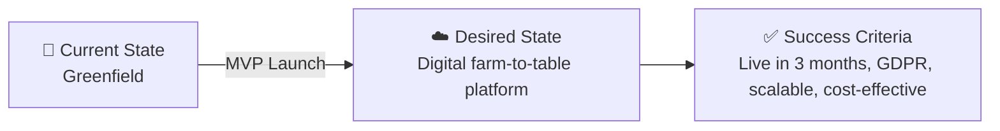

# 📋 Step 1: Requirements - nordic-fresh-mvp

<strong>📑 Requirements Overview</strong>

- [🎯 Project Overview](#-project-overview)
- [🚀 Functional Requirements](#-functional-requirements)
- [⚡ Non-Functional Requirements (NFRs)](#-non-functional-requirements-nfrs)
- [🔒 Compliance & Security Requirements](#-compliance--security-requirements)
- [💰 Budget](#-budget)
- [🔧 Operational Requirements](#-operational-requirements)
- [🌍 Regional Preferences](#-regional-preferences)
- [📊 Complexity Classification](#-complexity-classification)
- [📋 Summary for Architecture Assessment](#-summary-for-architecture-assessment)
- [References](#references)

> Generated by @requirements agent | 2026-03-06

| ⬅️ Previous | 📑 Index            | Next ➡️                                                        |
| ----------- | ------------------- | -------------------------------------------------------------- |
| —           | [README](README.md) | [02-architecture-assessment.md](02-architecture-assessment.md) |

## 🎯 Project Overview

| Field                   | Value                                                |
| ----------------------- | ---------------------------------------------------- |
| **Project Name**        | nordic-fresh-mvp                                     |
| **Project Type**        | Full-Stack (N-Tier Web Application)                  |
| **Timeline**            | March 2026 → June 2026                               |
| **Primary Stakeholder** | Nordic Fresh Foods, Stockholm                        |
| **Business Context**    | Farm-to-table delivery platform for 500+ restaurants |

### Business Context

| Field               | Value                                                         |
| ------------------- | ------------------------------------------------------------- |
| Industry / Vertical | Food & Beverage                                               |
| Company Size        | Enterprise (500+ employees)                                   |
| Current State       | Greenfield                                                    |
| Migration Source    | N/A                                                           |
| Business Drivers    | Enable digital ordering, supply chain efficiency, compliance  |
| Success Criteria    | MVP live in 3 months, GDPR compliance, < $500/mo infra, scale |

### State Transition

## 🚀 Functional Requirements

### Core Capabilities

| #   | Capability                                  | Priority  | Acceptance Criteria                         |
| --- | ------------------------------------------- | --------- | ------------------------------------------- |
| 1   | Restaurant onboarding & management          | 🔴 Must   | 500+ partners can register/manage profiles  |
| 2   | Consumer ordering (web/mobile)              | 🔴 Must   | 10,000+ users can place/manage orders       |
| 3   | Supply chain tracking (orders, inventory)   | 🟡 Should | Real-time status for all supply chain steps |
| 4   | Secure payment processing                   | 🔴 Must   | PCI-compliant, supports EU payment methods  |
| 5   | Notifications (order status, supply alerts) | 🟡 Should | Email/SMS/app notifications for key events  |
| 6   | Admin dashboard/reporting                   | 🟡 Should | Admins can view KPIs, export data           |

### User Types

| User Type  | Description            | Est. Count | Access Level |
| ---------- | ---------------------- | ---------- | ------------ |
| Restaurant | Partner restaurant     | 500+       | Contributor  |
| Consumer   | End-user ordering food | 10,000+    | Reader       |
| Admin      | Nordic Fresh staff     | 5          | Admin        |

### Integrations

| System          | Direction | Protocol | Auth Method | SLA   |
| --------------- | --------- | -------- | ----------- | ----- |
| Payment Gateway | Outbound  | REST     | API Key     | 99.9% |
| SMS/Email       | Outbound  | REST     | API Key     | 99.9% |
| Azure AD        | Inbound   | OAuth2   | Managed ID  | 99.9% |

### Data Types

| Category      | Sensitivity | Est. Volume | Retention | Residency   |
| ------------- | ----------- | ----------- | --------- | ----------- |
| Personal data | 🔴 High     | 10,000+     | 2 years   | EU (Sweden) |
| Payment data  | 🔴 High     | 10,000+     | 1 year    | EU (Sweden) |
| Business data | 🟡 Medium   | 500+        | 3 years   | EU (Sweden) |
| Public data   | 🟢 Low      | N/A         | N/A       | N/A         |
| Health data   | 🔴 High     | <100        | 1 year    | EU (Sweden) |

### Architecture Pattern

| Field              | Value                        |
| ------------------ | ---------------------------- |
| Workload Pattern   | N-Tier Web Application       |
| Recommended Option | App Service + SQL + KeyVault |
| Tier               | Balanced                     |
| Justification      | Managed, scalable, GDPR/EU   |

## ⚡ Non-Functional Requirements (NFRs)

| WAF Pillar     | Metric             | Target               | Current | Gap |
| -------------- | ------------------ | -------------------- | ------- | --- |
| 🔄 Reliability | SLA                | 99.9%                | N/A     | Yes |
| 🔄 Reliability | RTO                | 24h                  | N/A     | Yes |
| 🔄 Reliability | RPO                | 12h                  | N/A     | Yes |
| ⚡ Performance | Page Load          | <2s                  | N/A     | Yes |
| ⚡ Performance | API Response (p95) | <500ms               | N/A     | Yes |
| ⚡ Performance | Concurrent Users   | 1,000                | N/A     | Yes |
| 🔒 Security    | Auth Method        | Azure AD             | —       | —   |
| 🔒 Security    | Encryption         | At-rest + In-transit | —       | —   |
| 💰 Cost        | Monthly Budget     | $500                 | —       | —   |
| 🔧 Operations  | Uptime Monitoring  | Yes                  | —       | —   |

### Scalability

| Dimension        | Current | 6-Month Projection | 12-Month Projection |
| ---------------- | ------- | ------------------ | ------------------- |
| Users            | 10,000  | 15,000             | 20,000              |
| Data Volume      | 1 GB    | 2 GB               | 5 GB                |
| Transactions/day | 1,000   | 2,000              | 5,000               |

## 🔒 Compliance & Security Requirements

### Regulatory Frameworks

<strong>PCI-DSS</strong> — Not Applicable

| Requirement             | Applicability | Notes                     |
| ----------------------- | ------------- | ------------------------- |
| Cardholder data storage | No            | Payments via gateway only |
| Network segmentation    | No            | Managed services          |
| Encryption requirements | Yes           | All data encrypted        |

<strong>SOC 2</strong> — Not Applicable

| Trust Principle | Applicability | Notes |
| --------------- | ------------- | ----- |
| Security        | No            |       |
| Availability    | No            |       |
| Confidentiality | No            |       |

<strong>HIPAA</strong> — Not Applicable

| Requirement   | Applicability | Notes |
| ------------- | ------------- | ----- |
| PHI handling  | No            |       |
| BAA required  | No            |       |
| Audit logging | No            |       |

<strong>GDPR</strong> — Applicable

| Requirement      | Applicability | Notes              |
| ---------------- | ------------- | ------------------ |
| EU data subjects | Yes           | All users EU-based |
| Data residency   | Yes           | All data in Sweden |
| Right to erasure | Yes           | User self-service  |

<strong>ISO 27001</strong> — Not Applicable

| Control Area        | Applicability | Notes |
| ------------------- | ------------- | ----- |
| Access control      | No            |       |
| Asset management    | No            |       |
| Incident management | No            |       |

### Data Residency

| Requirement       | Value              |
| ----------------- | ------------------ |
| EU Data Residency | Required           |
| Azure Region      | swedencentral      |
| Data Retention    | 1-3 years (varies) |

### Security Controls

| Control                   | Required | Notes                   |
| ------------------------- | -------- | ----------------------- |
| Managed Identity (AAD)    | Yes      | All services            |
| Key Vault for secrets     | Yes      | All credentials/secrets |
| TLS encryption in transit | Yes      | All endpoints           |
| Private endpoints         | Yes      | For data services       |
| Network security groups   | Yes      | For all subnets         |
| Web Application Firewall  | Yes      | Azure WAF               |

## 💰 Budget

| Item                 | Estimate (USD/month) |
| -------------------- | -------------------- |
| App Service          | $100                 |
| Azure SQL Database   | $150                 |
| Azure Key Vault      | $20                  |
| Azure Storage        | $30                  |
| Application Insights | $20                  |
| Azure AD (Entra ID)  | $30                  |
| Azure WAF            | $50                  |
| Other                | $100                 |
| **Total**            | **$500**             |

## 🔧 Operational Requirements

- Managed services only (no VMs)
- Automated deployment (IaC: Bicep)
- Monitoring & alerting (App Insights)
- Backup & restore for database
- Minimal manual intervention
- Support for seasonal 3x load spikes
- 24/7 support not required for MVP

## 🌍 Regional Preferences

| Requirement    | Value           |
| -------------- | --------------- |
| Azure Region   | swedencentral   |
| Data Residency | EU (Sweden)     |
| Environments   | Dev, Production |

## 📊 Complexity Classification

- MVP scope, moderate complexity
- 3 developers, 1 engineer
- Managed Azure services only
- No legacy migration
- Compliance: GDPR only

## 📋 Summary for Architecture Assessment

- N-Tier Web Application (App Service, SQL, Key Vault, Storage, WAF)
- Balanced tier, managed services, EU region
- $500/month budget, 3-month timeline
- GDPR compliance, EU data residency
- Bicep for IaC
- Environments: Dev, Production
- No VMs, no legacy migration
- Security: Managed Identity, Key Vault, TLS, WAF

## References

- [Azure Defaults Skill](../../.github/skills/azure-defaults/SKILL.md)
- [Azure Artifacts Skill](../../.github/skills/azure-artifacts/SKILL.md)
- [GDPR Compliance](https://learn.microsoft.com/en-us/compliance/regulatory/offering-gdpr/)
- [Azure Bicep](https://learn.microsoft.com/en-us/azure/azure-resource-manager/bicep/overview)

---

> Generated by requirements agent | 2026-03-06
