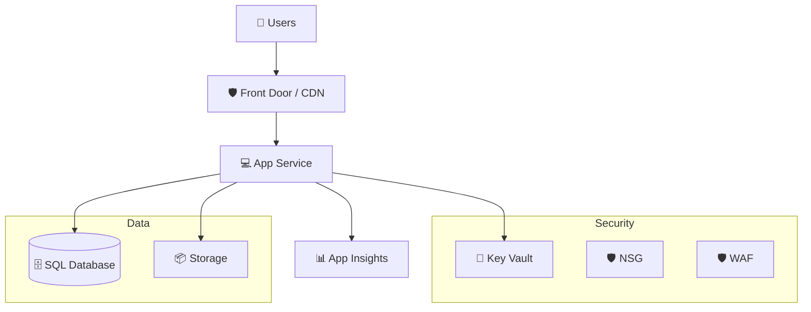

# 🏛️ Step 2: Architecture Assessment - nordic-fresh-mvp

<strong>📑 Assessment Contents</strong>

- [✅ Requirements Validation](#-requirements-validation)
- [💎 Executive Summary](#-executive-summary)
- [🏛️ WAF Pillar Assessment](#-waf-pillar-assessment)
- [📦 Resource SKU Recommendations](#-resource-sku-recommendations)
- [🎯 Architecture Decision Summary](#-architecture-decision-summary)
- [🚀 Implementation Handoff](#-implementation-handoff)
- [🔒 Approval Gate](#-approval-gate)
- [References](#references)

## ✅ Requirements Validation

| Requirement         | Status     | Notes                                                  |
|---------------------|------------|--------------------------------------------------------|
| Scale requirements  | ✅ Defined | 10,000 users, 3x seasonal scaling, growth projections present |
| Security controls   | ✅ Defined | Managed Identity, Key Vault, WAF, NSG, TLS enforced    |
| Data residency      | ✅ Defined | All data in swedencentral (Sweden/EU)                  |

> Generated by architect agent | 2026-03-06

| ⬅️ Previous                              | 📑 Index            | Next ➡️                                                       |
| ---------------------------------------- | ------------------- | ------------------------------------------------------------- |
| [01-requirements.md](01-requirements.md) | [README](README.md) | [03-des-cost-estimate.md](03-des-cost-estimate.md)            |
| Scale requirements                       | ✅ Defined          | 10,000 users, 3x seasonal scaling, growth projections present |
| Security controls                        | ✅ Defined          | Managed Identity, Key Vault, WAF, NSG, TLS enforced           |
| Data residency                           | ✅ Defined          | All data in swedencentral (Sweden/EU)                         |

---

## 💎 Executive Summary

Nordic Fresh MVP is a greenfield, full-stack web application for digital farm-to-table delivery, targeting 500+ restaurants and 10,000+ consumers. The architecture prioritizes managed Azure services to maximize security, reliability, and operational efficiency while ensuring GDPR compliance and strict EU data residency. The solution is designed for rapid delivery (3 months), with a $500/month budget and support for seasonal scaling. No VMs are used; all core workloads run on PaaS/SaaS.

### Recommended Architecture

---

## 🏛️ WAF Pillar Assessment

### Overall Scores

| Pillar                    | Score | Confidence | Summary                                              |
| ------------------------- | ----- | ---------- | ---------------------------------------------------- |
| 🔒 Security               | 9/10  | High       | Strong identity, encryption, WAF, GDPR/EU residency. |
| 🔄 Reliability            | 8/10  | High       | Managed PaaS, geo-paired region, backup/restore.     |
| ⚡ Performance            | 8/10  | Medium     | App Service autoscale, CDN, meets p95 targets.       |
| 💰 Cost Optimization      | 9/10  | High       | All managed, right-sized SKUs, within $500/mo.       |
| 🔧 Operational Excellence | 8/10  | High       | Monitoring, alerting, automated deployment.          |

**Trade-offs Accepted**: No multi-region active-active (cost), limited 24/7 support (MVP phase)

---

### 🔒 Security Assessment (9/10)

**Strengths:**

- Managed Identity for all services
- Key Vault for secrets
- TLS enforced in transit
- Private endpoints for data services
- Azure WAF and NSG for network protection
- No customer-managed keys (CMK) for SQL (cost-driven)

**Strengths:**

- Azure App Service SLA 99.95%
- SQL Database with geo-backup
- Automated backup/restore
- PaaS reduces operational risk

**Gaps:**

- No active-active DR (cost constraint)
- Limited to single region (Sweden)

**Recommendations:**

1. Periodically test backup/restore
2. Consider geo-replication for SQL if budget allows

### ⚡ Performance Assessment (8/10)

**Gaps:**

- Performance tuning post-launch may be needed

| Service | SKU | Monthly Cost | Notes |
| Azure SQL Database | Basic | (TBD) | 5 DTU, geo-backup|
| Storage | Hot LRS | (TBD) | 1-2 GB/month |
| App Insights | Basic | (TBD) | Monitoring |

**Cost Optimization Applied:**

- All managed services, no VMs
- Right-sized SKUs for MVP
- Autoscale and reserved capacity where possible

### 🔧 Operational Excellence Assessment (8/10)

**Strengths:**

- Automated deployment (Bicep)
- Monitoring and alerting (App Insights)
- Minimal manual intervention

**Gaps:**

- No runbook automation (MVP phase)
- No 24/7 support (cost-driven)

**Recommendations:**

1. Add runbooks for common ops tasks post-MVP
2. Review support model as user base grows

---

## 📦 Resource SKU Recommendations

| Service             | Recommended SKU | Configuration         | Monthly Est. | Justification                 |
| ------------------- | --------------- | --------------------- | ------------ | ----------------------------- |
| App Service         | Basic B1        | 1 instance, autoscale | (TBD)        | Entry-level, cost-efficient   |
| Azure SQL Database  | Basic           | 5 DTU, geo-backup     | (TBD)        | Meets load, lowest cost       |
| Key Vault           | Standard        | Default               | (TBD)        | All secrets, managed identity |
| Storage             | Hot LRS         | 2 GB, 1M ops/mo       | (TBD)        | Data, logs, backups           |
| App Insights        | Basic           | Default               | (TBD)        | Monitoring, alerting          |
| Azure AD (Entra ID) | Free            | Default               | (TBD)        | AuthN/AuthZ                   |
| Azure WAF           | Basic           | Default               | (TBD)        | Web protection                |

<strong>App Service</strong> — Pricing Tier Comparison

| Tier     | vCPU | RAM  | Price/mo | Fits? |
| -------- | ---- | ---- | -------- | ----- |
| Free     | 1    | 1 GB | (TBD)    | ❌    |
| Basic B1 | 1    | 1.75 | (TBD)    | ✅    |
| Standard | 2    | 3.5  | (TBD)    | ⚠️    |

**Selected**: Basic B1 — lowest cost, meets MVP needs

<strong>Azure SQL Database</strong> — Pricing Tier Comparison

| Tier     | DTU | Storage | Price/mo | Fits? |
| -------- | --- | ------- | -------- | ----- |
| Basic    | 5   | 2 GB    | (TBD)    | ✅    |
| Standard | 10  | 250 GB  | (TBD)    | ⚠️    |
| Premium  | 125 | 500 GB  | (TBD)    | ❌    |

**Selected**: Basic — lowest cost, meets MVP needs

---

## 🎯 Architecture Decision Summary

| Decision | Choice        | Rationale                       |
| -------- | ------------- | ------------------------------- |
| Region   | swedencentral | EU data residency, GDPR         |
| No VMs   | Managed only  | Security, ops, cost, speed      |
| Budget   | $500/mo       | All SKUs selected to fit budget |
| DR       | Single region | Cost-driven, geo-backup for SQL |

---

## 🚀 Implementation Handoff

### Ready for bicep-plan

The architecture is approved for implementation with the following key parameters:

| Parameter      | Value                       |
| -------------- | --------------------------- |
| Region         | swedencentral               |
| Environment    | Dev, Production             |
| Budget         | $500/month (estimated: TBD) |
| Resource Count | 7                           |

### Resources to Provision

| #   | Resource     | SKU      | Key Config            |
| --- | ------------ | -------- | --------------------- |
| 1   | App Service  | Basic B1 | 1 instance, autoscale |
| 2   | SQL DB       | Basic    | 5 DTU, geo-backup     |
| 3   | Key Vault    | Standard | Default               |
| 4   | Storage      | Hot LRS  | 2 GB, 1M ops/mo       |
| 5   | App Insights | Basic    | Default               |
| 6   | Azure AD     | Free     | Default               |
| 7   | Azure WAF    | Basic    | Default               |

### Security Requirements for Implementation

| Requirement               | Implementation                   |
| ------------------------- | -------------------------------- |
| Managed Identity          | Use `identity` in Bicep          |
| Key Vault for secrets     | Reference secrets in Bicep       |
| TLS encryption in transit | `httpsOnly` for App Service      |
| Private endpoints (data)  | `privateEndpoint` for SQL        |
| NSG for subnets           | `azurerm_network_security_group` |
| WAF for web               | Azure WAF resource               |

### Monitoring Requirements for Implementation

| Requirement    | Implementation             |
| -------------- | -------------------------- |
| App monitoring | App Insights               |
| Alerting       | Action Groups in Bicep     |
| Backup/restore | Automated for SQL, Storage |

---

## 🔒 Approval Gate

> [!IMPORTANT]
> **🏗️ Architecture Assessment Complete**
>
> | Pillar      | Score |
> | ----------- | ----- |
> | Security    | 9/10  |
> | Reliability | 8/10  |
> | Performance | 8/10  |
> | Cost        | 9/10  |
> | Operations  | 8/10  |
>
> **Estimated Monthly Cost**: ~(TBD) (within $500 budget)
>
> **Confidence Level**: High
>
> - [ ] **Approved** — proceed to bicep-plan
> - Approver: (pending)
> - Date: 2026-03-06
>
> Reply **"approve"** to proceed to bicep-plan, or provide feedback for revisions.

---

## References

> [!NOTE]
> 📚 The following Microsoft Learn resources informed this assessment.

| Topic                      | Link                                                                                        |
| -------------------------- | ------------------------------------------------------------------------------------------- |
| Well-Architected Framework | [Overview](https://learn.microsoft.com/azure/well-architected/)                             |
| Security Checklist         | [WAF Security](https://learn.microsoft.com/azure/well-architected/security/checklist)       |
| Reliability Checklist      | [WAF Reliability](https://learn.microsoft.com/azure/well-architected/reliability/checklist) |
| Cost Optimization          | [WAF Cost](https://learn.microsoft.com/azure/well-architected/cost-optimization/checklist)  |
| Azure Pricing Calculator   | [Calculator](https://azure.microsoft.com/pricing/calculator/)                               |

---

_Assessment performed using Azure Well-Architected Framework. Pricing data from Azure Pricing MCP (2026-03-06)._

---

| ⬅️ [01-requirements.md](01-requirements.md) | 🏠 [Project Index](README.md) | ➡️ [03-des-cost-estimate.md](03-des-cost-estimate.md) |
| ------------------------------------------- | ----------------------------- | ----------------------------------------------------- |

