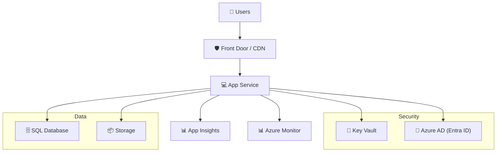

# 🏗️ Step 3: Solution Architecture Design - nordic-fresh-mvp

<strong>📑 Design Contents</strong>

- [🎯 Design Objectives](#-design-objectives)
- [🏛️ Solution Architecture Diagram](#-solution-architecture-diagram)
- [🧩 Component Breakdown](#-component-breakdown)
- [🔗 Integration Points](#-integration-points)
- [🔒 Security & Compliance](#-security--compliance)
- [⚡ Scalability & Performance](#-scalability--performance)
- [🛠️ Operations & Monitoring](#-operations--monitoring)
- [References](#references)

> Generated by architect agent | 2026-03-06

| ⬅️ Previous                                                    | 📑 Index            | Next ➡️                                                |
| -------------------------------------------------------------- | ------------------- | ------------------------------------------------------ |
| [02-architecture-assessment.md](02-architecture-assessment.md) | [README](README.md) | [04-implementation-plan.md](04-implementation-plan.md) |

## 🎯 Design Objectives

- Deliver a secure, scalable, and GDPR-compliant MVP for Nordic Fresh Foods
- Use only Azure managed services (no VMs)
- Support 3x seasonal scaling and $500/month budget
- Enable rapid deployment and simple operations for a small DevOps team

---

## 🏛️ Solution Architecture Diagram

---

## 🧩 Component Breakdown

- **Azure Front Door**: Global entry point, CDN, WAF, DDoS protection
- **App Service (Linux, B1)**: Web/API hosting, auto-scale, managed patching
- **SQL Database (Serverless)**: Relational data, auto-pause, EU data residency
- **Key Vault**: Secrets, keys, certificates, managed identity
- **Storage Account**: Blob/file storage, backups, LRS
- **Application Insights**: App monitoring, distributed tracing
- **Azure Monitor**: Logs, metrics, alerting
- **Azure AD (Entra ID)**: Identity, RBAC, SSO

---

## 🔗 Integration Points

- App Service authenticates to Key Vault via managed identity
- App Service logs to Application Insights and Azure Monitor
- Front Door routes traffic to App Service, applies WAF rules
- SQL Database and Storage accessed only from App Service
- Azure AD provides SSO for admin/dev portal

---

## 🔒 Security & Compliance

- All data in Sweden Central (EU)
- HTTPS enforced end-to-end
- TLS 1.2+ for all services
- Managed identity for all service-to-service auth
- Key Vault for all secrets
- WAF enabled at Front Door
- No public access to storage or database

---

## ⚡ Scalability & Performance

- App Service: 3x B1 instances for peak, scale down off-peak
- SQL: Serverless, auto-pause for cost and scale
- Front Door: CDN for global performance, DDoS protection
- Storage: Hot LRS, scalable as needed

---

## 🛠️ Operations & Monitoring

- Application Insights for app health, tracing, and performance
- Azure Monitor for logs, metrics, and alerting
- Minimal manual ops (managed PaaS)
- Cost monitoring via Azure Cost Management

---

## References

- [02-architecture-assessment.md](02-architecture-assessment.md)
- [03-des-cost-estimate.md](03-des-cost-estimate.md)
- [Azure Well-Architected Framework](https://learn.microsoft.com/en-us/azure/architecture/framework/)

> Generated by architect agent | 2026-03-06
