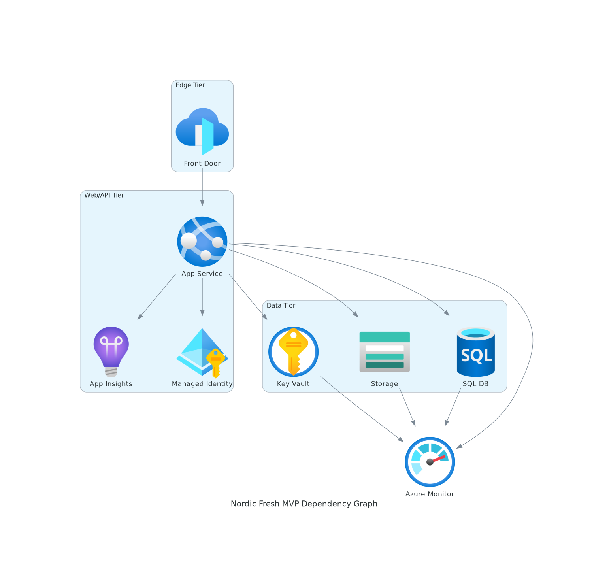
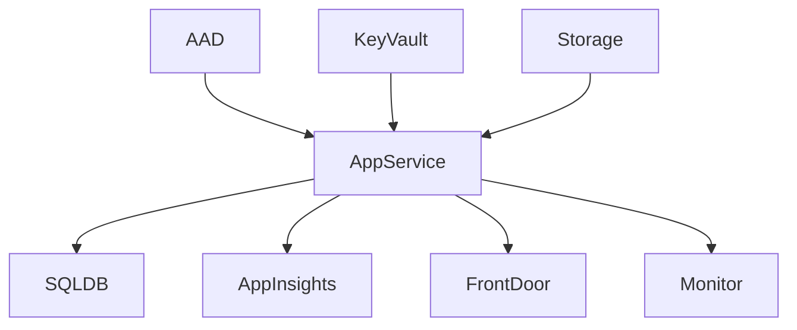
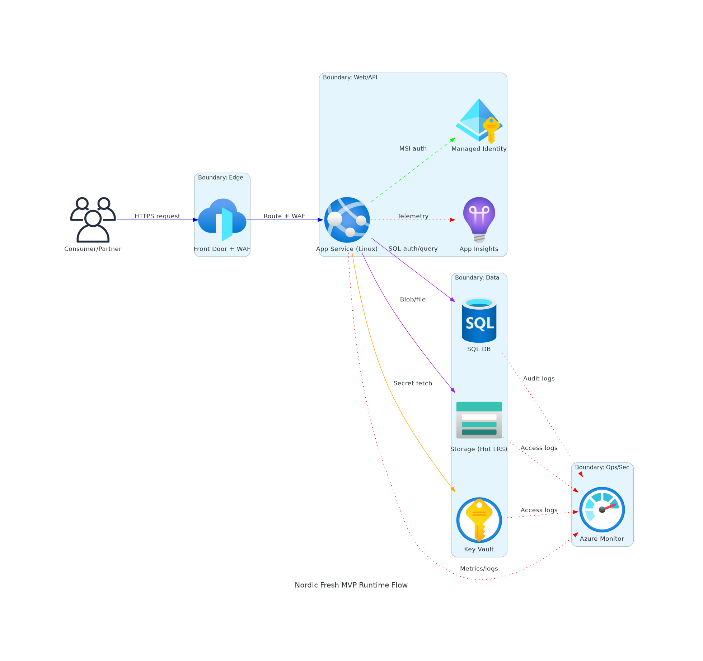
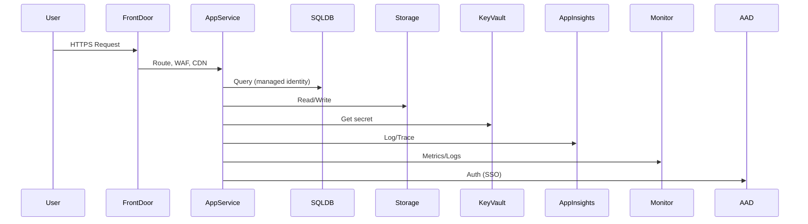

# 📀 Step 4: Implementation Plan - nordic-fresh-mvp


<details open>
<summary><strong>📑 Implementation Contents</strong></summary>

- [📋 Overview](#-overview)
- [📦 Resource Inventory](#-resource-inventory)
- [🗂️ Module Structure](#-module-structure)
- [🔨 Implementation Tasks](#-implementation-tasks)
- [🚀 Deployment Phases](#-deployment-phases)
- [🔗 Dependency Graph](#-dependency-graph)
- [🔄 Runtime Flow Diagram](#-runtime-flow-diagram)
- [🏷️ Naming Conventions](#-naming-conventions)
- [🔐 Security Configuration](#-security-configuration)
- [⏱️ Estimated Implementation Time](#-estimated-implementation-time)
- [🔒 Approval Gate](#-approval-gate)
- [References](#references)

</details>

> Generated by bicep-plan agent | 2026-03-06

| ⬅️ Previous                                                  | 📑 Index            | Next ➡️                                        |
| ------------------------------------------------------------ | ------------------- | ---------------------------------------------- |
| [04-governance-constraints.md](04-governance-constraints.md) | [README](README.md) | [04-preflight-check.md](04-preflight-check.md) |

## 📋 Overview

This plan implements the nordic-fresh-mvp solution architecture using Azure Bicep, following AVM-first and security best practices. All resources are deployed in Sweden Central for GDPR compliance, with managed identity and cost controls.

---

## 📦 Resource Inventory

| Resource              | Type                                     | SKU / Tier                         | AVM Status | Dependencies       | Status  |
| --------------------- | ---------------------------------------- | ---------------------------------- | ---------- | ------------------ | ------- |
| App Service (Web App) | Microsoft.Web/sites                      | B1 (Basic, Linux)                  | ✅ AVM     | Storage, Key Vault | ⬜ Todo |
| SQL Database          | Microsoft.Sql/servers/databases          | General Purpose, Serverless, 5 DTU | ✅ AVM     | Key Vault          | ⬜ Todo |
| Key Vault             | Microsoft.KeyVault/vaults                | Standard                           | ✅ AVM     |                    | ⬜ Todo |
| Storage Account       | Microsoft.Storage/storageAccounts        | Standard, Hot LRS                  | ✅ AVM     |                    | ⬜ Todo |
| Front Door            | Microsoft.Cdn/profiles/endpoints         | Standard/Premium                   | ✅ AVM     | App Service        | ⬜ Todo |
| Application Insights  | Microsoft.Insights/components            | Basic (Pay-As-You-Go)              | ✅ AVM     | App Service        | ⬜ Todo |
| Azure Monitor         | Microsoft.OperationalInsights/workspaces | Basic (Log Analytics, 1GB/day)     | ✅ AVM     |                    | ⬜ Todo |
| Azure AD (Entra ID)   | Microsoft.Entra/identities               | Free Tier                          | ✅ AVM     |                    | ⬜ Todo |

---

## 🗂️ Module Structure

```text
infra/bicep/nordic-fresh-mvp/
├── main.bicep
├── main.bicepparam
├── modules/
│   ├── appservice.bicep
│   ├── sqldb.bicep
│   ├── keyvault.bicep
│   ├── storage.bicep
│   ├── frontdoor.bicep
│   ├── appinsights.bicep
│   ├── monitor.bicep
│   └── aad.bicep
└── deploy.ps1
```

| Module            | AVM Source                                       | Version | Purpose            |
| ----------------- | ------------------------------------------------ | ------- | ------------------ |
| appservice.bicep  | br/public:avm/res/web/sites                      | 1.x.x   | Web/API hosting    |
| sqldb.bicep       | br/public:avm/res/sql/servers/databases          | 1.x.x   | Relational DB      |
| keyvault.bicep    | br/public:avm/res/keyvault/vaults                | 1.x.x   | Secrets management |
| storage.bicep     | br/public:avm/res/storage/accounts               | 1.x.x   | Blob/file storage  |
| frontdoor.bicep   | br/public:avm/res/cdn/profiles                   | 1.x.x   | CDN, WAF, DDoS     |
| appinsights.bicep | br/public:avm/res/insights/components            | 1.x.x   | App monitoring     |
| monitor.bicep     | br/public:avm/res/operationalinsights/workspaces | 1.x.x   | Logs, metrics      |
| aad.bicep         | br/public:avm/res/entra/identities               | 1.x.x   | Identity, RBAC     |

---

## 🔨 Implementation Tasks

### Task 1: main.bicep (Orchestration)

- Reference all modules
- Pass uniqueSuffix, tags, region
- Enforce security baseline (TLS, HTTPS, managed identity)

### Task 2: appservice.bicep

- Deploy App Service (Linux, B1)
- Configure scaling, identity, logging

### Task 3: sqldb.bicep

- Deploy SQL Database (serverless, 5 DTU)
- Enable auto-pause, secure access

### Task 4: keyvault.bicep

- Deploy Key Vault, set access policies

### Task 5: storage.bicep

- Deploy Storage Account (Hot LRS)
- Disable public access

### Task 6: frontdoor.bicep

- Deploy Front Door (Standard/Premium)
- Enable WAF, CDN, HTTPS

### Task 7: appinsights.bicep

- Deploy Application Insights, link to App Service

### Task 8: monitor.bicep

- Deploy Log Analytics workspace

### Task 9: aad.bicep

- Integrate Azure AD (Entra ID)

---

## 🚀 Deployment Phases

1. Foundation: Storage, Key Vault, Monitor, AAD
2. Core: App Service, SQL Database, Application Insights
3. Edge: Front Door, WAF, CDN

---

## 🔗 Dependency Graph



<details>
<summary>Diagram Source: 04-dependency-diagram.py</summary>

See [04-dependency-diagram.py](./04-dependency-diagram.py)

</details>



---

## 🔄 Runtime Flow Diagram



<details>
<summary>Diagram Source: 04-runtime-diagram.py</summary>

See [04-runtime-diagram.py](./04-runtime-diagram.py)

</details>



---

## 🏷️ Naming Conventions

- CAF-compliant, use uniqueSuffix from resourceGroup().id
- All resources tagged: Environment, ManagedBy, Project, Owner

---

## 🔐 Security Configuration

- HTTPS only, TLS 1.2+
- Managed identity for all services
- No public access to storage or SQL
- WAF enabled at Front Door
- Key Vault for all secrets

---

## ⏱️ Estimated Implementation Time

- Bicep authoring: 2 days
- Review & testing: 1 day
- Deployment: 0.5 day
- Buffer: 0.5 day
- **Total: ~4 days**

---

## 🔒 Approval Gate

- Review IaC plan, confirm resource inventory and security

---

## References

- [03-des-solution-architecture.md](03-des-solution-architecture.md)
- [02-architecture-assessment.md](02-architecture-assessment.md)
- [Azure Bicep AVM Modules](https://azure.github.io/avm-accelerator/)

> Generated by bicep-plan agent | 2026-03-06
