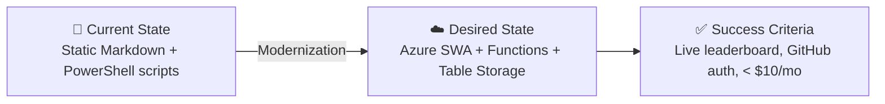

# Step 1: Requirements - team-leaderboard


<details>
<summary><strong>📑 Table of Contents</strong></summary>

- [Project Overview](#project-overview)
- [Functional Requirements](#functional-requirements)
- [Non-Functional Requirements (NFRs)](#non-functional-requirements-nfrs)
- [Compliance & Security Requirements](#compliance--security-requirements)
- [Budget](#budget)
- [Operational Requirements](#operational-requirements)
- [Regional Preferences](#regional-preferences)
- [Summary for Architecture Assessment](#summary-for-architecture-assessment)
- [References](#references)

</details>

> Generated by @requirements agent | 2026-02-11

| ⬅️ Previous | 📑 Index | Next ➡️ |
| --- | --- | --- |
| — | [README](README.md) | [02-architecture-assessment.md](02-architecture-assessment.md) |

## Project Overview

### Business Context

| Attribute | Value |
| --- | --- |
| **Industry** | Education / Training |
| **Company Size** | Small team (hackathon facilitators) |
| **Scenario** | Greenfield — new web application |
| **System Description** | Transform the existing hackathon scoring rubric into a live, interactive web application for facilitators to score teams and participants to view a real-time leaderboard |

### Problem Statement

The hackathon scoring system currently exists as a static Markdown file ([scoring-rubric.md](../../hackathon/facilitator/scoring-rubric.md)) and PowerShell scripts (`Score-Team.ps1`, `Get-Leaderboard.ps1`). Facilitators must run scripts manually, and participants have no visibility into scores until results are announced. The goal is to create a lightweight web app that allows facilitators to enter scores via a form and displays a live leaderboard to all participants.

### Source Material

The scoring rubric defines:

- **7 scored categories** (105 base points): Requirements (20), Architecture (25), Implementation (25), Deployment (20), Load Testing (5), Documentation (5), Diagnostics (5)
- **4 bonus categories** (+25 max): Zone Redundancy (+5), Private Endpoints (+5), Multi-Region DR (+10), Managed Identities (+5)
- **Grading scale**: Outstanding (≥90%), Excellent (≥80%), Good (≥70%), Satisfactory (≥60%), Needs Improvement (<60%)
- **5 award categories**: Best Overall, Security Champion, Cost Optimizer, Best Architecture, Speed Demon
- **Score sheet** supporting multiple teams

### Architecture Pattern

| Attribute | Value |
| --- | --- |
| **Workload Pattern** | Static Site with serverless API |
| **Justification** | Small user base (<50), event-driven usage, minimal compute needs. SPA + Azure Functions is the cheapest architecture that supports authentication and data persistence. |

### State Transition



## Functional Requirements

### Core Features

| # | Feature | Priority | Description |
| --- | --- | --- | --- |
| F1 | Score entry form | Must-Have | Facilitators enter scores per team across all 7 categories + 4 bonus items. Each criterion within a category has individual point entry. |
| F2 | Live leaderboard | Must-Have | Real-time ranking of all teams by total score, visible to all users. Auto-updates when new scores are submitted. |
| F3 | Grading display | Must-Have | Each team shows calculated grade (Outstanding/Excellent/Good/Satisfactory/Needs Improvement) based on percentage of 105 base points. |
| F4 | Award categories | Must-Have | Display special award winners: Best Overall, Security Champion, Cost Optimizer, Best Architecture, Speed Demon. Facilitators can assign awards. |
| F5 | Authentication | Must-Have | GitHub authentication for facilitators to enter/modify scores. Participants can view leaderboard without login. |
| F6 | JSON score upload | Must-Have | Facilitators can drag-and-drop or browse to upload a `score-results.json` file (the output format of `Score-Team.ps1`). The app parses the JSON and populates/updates all scores for the specified team in one action. Validates the JSON structure before importing and shows a preview with confirm/cancel. |

### User Roles

| Role | Permissions |
| --- | --- |
| **Facilitator** | Create/edit/delete team scores, assign awards, manage teams |
| **Participant** | View leaderboard, view own team score breakdown (read-only) |
| **Anonymous** | No access (authentication required for all views) |

### Data Model

| Entity | Fields |
| --- | --- |
| **Team** | teamName, teamMembers[], createdAt |
| **Score** | teamName, category, criterion, points, maxPoints, scoredBy, timestamp |
| **BonusScore** | teamName, enhancement, points, verified, timestamp |
| **Award** | category, teamName, assignedBy, timestamp |

## Non-Functional Requirements (NFRs)

| Requirement | Target | Justification |
| --- | --- | --- |
| **Availability (SLA)** | 99.9% | Standard SWA + Functions SLA is sufficient for event use |
| **Response Time** | < 2 seconds | Dashboard should load quickly during live events |
| **Concurrent Users** | Up to 50 | Small hackathon event (facilitators + participants) |
| **RTO** | 4 hours | Acceptable for a non-critical event tool |
| **RPO** | 1 hour | Score data should be recoverable within 1 hour |
| **Data Retention** | Duration of event + 30 days | Scores needed during and shortly after hackathon |
| **Scalability** | No auto-scale needed | Fixed small audience, single event |

## Compliance & Security Requirements

### Compliance Frameworks

<details>
<summary><strong>GDPR</strong> — Applicable (Minimal)</summary>

| Requirement | Applicability | Notes |
| --- | --- | --- |
| EU data subjects | ✅ Yes | GitHub usernames and team names only |
| Data residency | ✅ Yes | Storage in swedencentral (EU) |
| Right to erasure | ⚠️ Low impact | Minimal PII; data deleted after event + 30 days |

</details>

### Recommended Security Controls

| Control | Implementation |
| --- | --- |
| **Authentication** | GitHub OAuth via Azure Static Web Apps built-in auth |
| **Authorization** | Role-based: facilitators (write), participants (read) |
| **Transport Security** | HTTPS-only (SWA default), TLS 1.2 minimum |
| **Data Protection** | Azure Table Storage encryption at rest (default) |
| **API Security** | Azure Functions with SWA authentication context |
| **No secrets in code** | Connection strings in SWA app settings, not source |

### Required Tags

| Tag | Value |
| --- | --- |
| `Environment` | `prod` |
| `ManagedBy` | `Bicep` |
| `Project` | `team-leaderboard` |
| `Owner` | `agentic-infraops` |

## Budget

| Component | Estimated Monthly Cost | Notes |
| --- | --- | --- |
| **Azure Static Web Apps (Standard)** | ~$9/mo | Includes custom auth, SWA staging |
| **Azure Functions (Consumption)** | ~$0/mo | Free tier covers <1M executions |
| **Azure Table Storage** | ~$0.05/mo | Minimal data (<1 GB), cheap at $0.045/GB |
| **Total Estimated** | **~$10/mo** | Well within $50/mo budget |

> **Note**: Azure Static Web Apps Standard tier is recommended over Free to support custom authentication configuration and role management. Functions Consumption plan is included at no additional cost within the SWA Standard plan's managed Functions.

## Operational Requirements

### Environments

| Environment | Purpose |
| --- | --- |
| **Production** | Single live deployment |

### Deployment

| Attribute | Value |
| --- | --- |
| **Method** | Azure Bicep IaC + GitHub Actions CI/CD |
| **Source Control** | GitHub repository |
| **Deployment Target** | Azure Static Web Apps with managed Functions API |
| **One-Click Deploy** | "Deploy to Azure" button in README |
| **Script Deploy** | `deploy.ps1` for CLI/automated deployment |

### Deploy to Azure Button

The repository README must include a **Deploy to Azure** button that links to the Azure Portal custom deployment experience using the Bicep/ARM template in the repo.

| Requirement | Detail |
| --- | --- |
| **Button format** | Standard Azure deploy badge: `[](https://portal.azure.com/#create/Microsoft.Template/uri/...)` |
| **Template source** | ARM JSON exported from Bicep (committed to repo as `azuredeploy.json`) |
| **Parameters exposed** | Project name, environment, owner tag, region |
| **Default values** | Pre-filled with sensible defaults (region: `westeurope`, env: `prod`) |
| **Validation** | Template must pass `az deployment group validate` before publishing |

### Monitoring

| Requirement | Implementation |
| --- | --- |
| **Basic monitoring** | Azure Static Web Apps built-in metrics |
| **Error tracking** | Application Insights (optional, adds ~$0) |

### Timeline

| Milestone | Target |
| --- | --- |
| **Requirements & Architecture** | Week 1 |
| **Implementation & Deploy** | Week 2 |
| **Total** | 1-2 weeks |

## Regional Preferences

| Resource | Region | Reason |
| --- | --- | --- |
| **Static Web App** | `westeurope` | SWA not available in swedencentral |
| **Storage Account** | `swedencentral` | EU GDPR-compliant default |
| **Resource Group** | `swedencentral` | Standard default |

## Summary for Architecture Assessment

### Recommended Architecture

```
┌─────────────────────────────────────────────────┐
│              Azure Static Web Apps               │
│          (Standard Plan, westeurope)             │
│                                                   │
│  ┌─────────────┐     ┌──────────────────────┐   │
│  │  SPA (React  │     │  Managed Functions   │   │
│  │  or similar) │────▶│  API (Node.js)       │   │
│  │  Frontend    │     │  /api/scores         │   │
│  └─────────────┘     │  /api/teams          │   │
│                       │  /api/awards         │   │
│                       └──────────┬───────────┘   │
│                                  │               │
│  Built-in Auth (GitHub OAuth)    │               │
└──────────────────────────────────┼───────────────┘
                                   │
                         ┌─────────▼──────────┐
                         │  Azure Table        │
                         │  Storage            │
                         │  (swedencentral)    │
                         │  - Teams table      │
                         │  - Scores table     │
                         │  - Awards table     │
                         └────────────────────┘
```

### Key Decisions for Architect

| Decision | Choice | Rationale |
| --- | --- | --- |
| **Hosting** | Azure Static Web Apps (Standard) | Cheapest option with built-in auth, managed Functions, free SSL |
| **API** | Managed Azure Functions (within SWA) | No separate Function App needed, included in SWA plan |
| **Data Store** | Azure Table Storage | Cheapest persistence (~$0.05/mo), simple key-value fits scoring data |
| **Auth Provider** | GitHub OAuth (SWA built-in) | Zero-config setup, participants already have GitHub accounts |
| **Frontend** | SPA (framework TBD by implementer) | Fast, responsive UI for live leaderboard updates |

### Scoring Rubric Integration

The app must faithfully implement the scoring structure from [scoring-rubric.md](../../hackathon/facilitator/scoring-rubric.md):

- 7 categories with weighted point values (105 base total)
- Individual criteria within each category (e.g., Requirements has 5 criteria × 4 pts each)
- 4 bonus enhancements with verification flags (+25 max)
- Percentage-based grading (5 tiers)
- 5 award categories assignable by facilitators
- Per-team score sheet with category subtotals and grand total

---

| ⬅️ — | 🏠 [Project Index](README.md) | ➡️ [02-architecture-assessment.md](02-architecture-assessment.md) |
| --- | --- | --- |

## References

- [Scoring Rubric Source](../../hackathon/facilitator/scoring-rubric.md)
- [Azure Static Web Apps Documentation](https://learn.microsoft.com/azure/static-web-apps/)
- [SWA Authentication & Authorization](https://learn.microsoft.com/azure/static-web-apps/authentication-authorization)
- [Azure Table Storage Pricing](https://azure.microsoft.com/pricing/details/storage/tables/)
- [SWA + Managed Functions](https://learn.microsoft.com/azure/static-web-apps/apis-functions)
